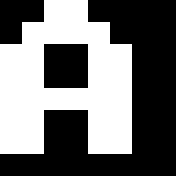
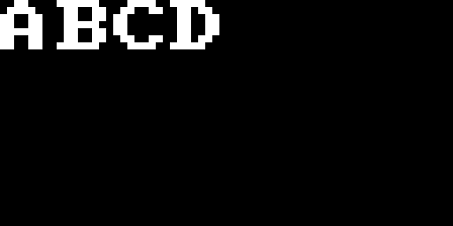

# V6 최종 실험 발표 자료

해시와 12비트 역상 탐색, 입력 표현, G3-U·D1-S·D1-T-L, 대조군, 평가량과 CLP를 설명하고 완료된 최종 실험 결과와 결론을 제시한다. 본문 47장, 상세 부록 14장이다.

**자료 구분:** 성능 수치는 완료된 `v6-study-r2` 최종 기록만 사용한다. 설명용 입력·목표 기호는 실험 결과와 구분한다. BGV·CGGE 이미지는 고정 입력 `ABCD`를 V6 인코더로 변환한 결과다.

## 1. 생성 모델은 해시 목표값을 더 잘 맞힐 수 있을까

**발표자 설명**

이 발표는 완료된 V6 실행 v6-study-r2의 최종 결과를 다룬다. 해시와 12비트 역상 과제, 목표값과 window, 입력 표현, 확산 모델, 대조군, 평가량과 판정 기준, CLP를 설명하고 최종 결과와 결론을 제시한다. 본문은 47장, 상세 부록은 14장이다. 설정은 이 실행의 protocol.frozen.json과 구현 명세를 따른다. 성능 수치는 최종 기록만 사용한다. BGV·CGGE 이미지는 설명용 입력 ABCD의 실제 인코더 출력이다. 입력–목표 연결 예시는 기호로 표시하며 실험 성능 자료와 구분한다.

근거: `v6-study-r2 최종 기록`

## 2. 연구 질문과 최종 답변

- **질문**: 목표 해시값을 알려 주면, 학습한 모델이 무작위 탐색보다 일치하는 입력을 더 잘 찾는가?
- **관찰**: 정규 MD5에서 다섯 모델 조합의 성공률은 약 2.3~2.6%였다.
- **결론**: 두 대조군 각각에 대한 성공률 개선 +0.5%p 이상을 다섯 조합 모두에서 배제했다.
- **해석 범위**: 작은 효과의 가능성은 남는다. 모든 생성 모델의 한계를 증명한 결과는 아니다.

**발표자 설명**

여기서 성공률은 후보 100개 안에 목표와 일치하는 입력을 하나 이상 찾은 비율이다. 뒤에서 Success@100과 %p를 정의한다. 최종 종합 판정은 FINAL_REJECTED다. 이는 등록한 실험 범위에서의 판정이며 효과가 정확히 0이라는 뜻이 아니다. 최대 상한은 P-DISC의 Main−Shuffled +0.3778225%p다.

근거: `decision.json`

## 3. 해시와 역상 탐색

- **해시**: 입력 데이터로부터 정해진 길이의 값을 계산하는 규칙이다. MD5는 128비트, 16진수 32자리를 출력한다.
- **역상**: 주어진 해시 목표값과 일치하는 출력을 만드는 입력이다. 목표를 만들었던 원문과 같을 필요는 없다.
- **이번 과제**: MD5 전체 중 지정한 12비트가 목표와 같은 입력을 찾는다. 목표값은 4,096가지다.
- **성공 확인**: 생성된 입력을 실제 해시 함수에 넣고, 지정한 12비트가 같은지 검사한다.

**발표자 설명**

비트는 0 또는 1 한 자리이며, 바이트는 8비트다. 16진수 한 자리는 4비트이므로 12비트는 16진수 세 자리다. 2의 12제곱은 4,096이다. 충돌 탐색은 해시가 같은 서로 다른 두 입력을 찾는 별도의 문제다. 이 연구는 먼저 주어진 12비트 목표에 일치하는 임의의 입력을 찾는다. 원래 메시지 복원이나 MD5 전체 역상 복원을 측정하지 않았다.

근거: `연구 계획 §4.1, 구현 명세 §4.3`

## 4. 16진수 32자리는 128비트를 읽는 표기

- **사용하는 기호**: 0~9와 A~F, 총 16개. A=10, B=11, C=12, D=13, E=14, F=15
- **한 자리의 크기**: 16진수 한 자리 = 4비트. 따라서 32자리 = 128비트 = 16바이트

`01234567 89ABCDEF 01234567 89ABCDEF`

**발표자 설명**

16진수는 16개의 기호로 숫자를 나타내는 방식이다. 한 자리가 0000부터 1111까지 16가지 4비트 패턴을 표현한다. 비트는 0 또는 1 한 자리, 바이트는 8비트다. 화면의 문자열은 자릿수 설명을 위한 임의 표기이며 실제 메시지의 MD5 결과로 제시한 것이 아니다. 읽기 편하게 8자리씩 공백을 넣었지만 공백은 해시값에 포함되지 않는다. 어떤 입력 길이든 MD5 출력 길이는 128비트다.

근거: `연구 계획 §4.1, 구현 명세 §4.3`

## 5. W3와 W4는 해시를 읽는 위치

| 이름 | 16진수 32자리 중 위치 | 역할과 실제 실행 |
| --- | --- | --- |
| W3 | 17~19번째, 12비트 | 정규 MD5 주 실험과 규모 확대에 사용 |
| W4 | 9~11번째, 12비트 | 양성 결과 재현용으로 등록, 이번에는 미실행 |
| W1 | 1~3번째, 12비트 | 4단계로 약화한 MD5의 양성 대조에 사용 |

W3 결과를 W4에서도 확인했다고 말할 수는 없다.

**발표자 설명**

위치는 왼쪽부터 1로 센다. 표준 digest를 big-endian 정수 H로 읽으면 W3=(H>>52)&0xFFF, W4=(H>>84)&0xFFF, W1=(H>>116)&0xFFF다. W는 Window의 약자다. 윈도 번호는 난도나 실험 반복 횟수를 뜻하지 않는다. W3와 W4는 각각 12비트를 읽되 위치가 다르다. W4는 양성이 나온 경우에 새 위치에서 재현할 계획이었지만 이번 주 실험에는 양성 파이프라인이 없어 실행하지 않았다.

근거: `window.json, decision.json, 구현 명세 §4.3`

## 6. W3와 W4의 위치를 직접 읽는 예

| 왼쪽부터 센 위치 | 1~8번째 | 9~16번째 | 17~24번째 | 25~32번째 |
| --- | --- | --- | --- | --- |
| 설명용 값 | 01234567 | 89ABCDEF | 01234567 | 89ABCDEF |
| 읽을 구간 | W1: 012 | W4: 89A | W3: 012 | 이번 주 과제에서 제외 |

**발표자 설명**

표에서 자리는 왼쪽부터 1로 센다. 예시의 W3는 17,18,19번째 세 자리 012이고, W4는 9,10,11번째 세 자리 89A다. W1은 1,2,3번째 012다. 우연히 같은 예시 값 012라도 위치가 다르면 다른 window다. W3=(H>>52)&0xFFF, W4=(H>>84)&0xFFF이고 H는 표준 MD5 digest를 big-endian 정수로 읽은 값이다. 예시는 위치 설명용이며 새로운 후보 생성이나 해시 평가 결과가 아니다. 최종 실험에서는 W3를 평가했고 W4는 실행하지 않았다.

근거: `window.json, 구현 명세 §4.3`

## 7. 목표값은 해시가 맞혀야 하는 정답

- **요청**: 목표값 y = ABC, 사용할 구간은 W3로 정한다.
- **후보 생성**: 모델은 ABC를 조건으로 받아 입력 x를 만든다. 허용 길이는 4~31바이트다.
- **성공 확인**: MD5(x)의 17~19번째 세 자리가 ABC이면 성공이다. 나머지 자리는 달라도 된다.
- **평가 예산**: 원문과 같은 입력을 찾을 필요는 없다. 한 시행에서 후보 100개 안에 일치 입력을 찾는다.

**발표자 설명**

x는 생성할 입력이고 y는 맞혀야 하는 12비트 해시 목표값이다. 여기서 ABC는 16진수 세 자리인 목표값 예시다. 메시지 ABC를 출력하라는 요청과 다르다. 입력 ABC 자체는 3바이트라 이 실험의 길이 하한에도 맞지 않는다. 어떤 입력이든 허용 source와 길이를 만족하고 W3 값이 목표와 같으면 성공이다. ABC를 조건으로 실제 생성하거나 평가하지 않았으며 성공 후보를 제시하는 슬라이드가 아니다. 시험의 목표 pool은 학습에 쓰지 않은 1,024개 값이다.

근거: `protocol.frozen.json, 구현 명세 §4·§10`

## 8. r은 MD5 내부 계산 단계 수

- **r = 64**: 정상 MD5의 64단계를 모두 계산한다. 이번 주 실험은 W3, r=64다.
- **r = 4**: 처음 4단계와 최종 합산만 계산하는 약화한 함수다. W1에서 양성 대조로 사용했다.
- **서로 다른 역할**: r은 얼마나 계산하는지, W는 계산한 출력의 어느 부분을 읽는지 정한다.
- **별도의 숫자**: 학습 40,000회와 생성 25단계는 신경망 설정이다. MD5의 r과 별개다.

**발표자 설명**

명세의 H12_r^W(x)는 r개 압축 step과 feed-forward를 적용한 뒤 W 위치의 12비트를 읽는 함수다. 4단계 해시에서의 높은 성공률은 약화된 구조를 이용했다는 관찰이다. 정상 MD5의 보안이나 64단계 성능으로 일반화할 수 없다. W1의 과제와 W3의 과제는 각자 학습한 별도 과제다.

근거: `protocol.frozen.json, P.json, C.json`

## 9. 모델이 만들 수 있는 입력의 범위

| 설정 | 실제 값 | 의미 |
| --- | --- | --- |
| Printable, P | ASCII 33~126, 94개 기호 | 영문자·숫자·기호, 공백은 제외 |
| Random Bytes, R | 0~255, 256개 바이트 | 표시할 수 없는 값도 허용 |
| 길이 L | 4~31바이트 | 28개 길이를 같은 확률로 선택 |
| Source prior | 길이 선택 뒤 각 위치를 균등 추출 | 학습 입력과 Random 대조군의 기본 분포 |

**발표자 설명**

Source는 입력을 뽑는 분포다. P는 자연어 문장이나 비밀번호 모음이 아니라 94개 기호를 독립 균등 추출한 문자열이다. R도 실제 파일 모음이 아니라 바이트를 독립 균등 추출한 데이터다. 길이를 먼저 균등하게 뽑기 때문에 모든 가능한 메시지에 동일한 확률을 주는 방식은 아니다. 이름 R-DISC의 R은 Random 대조군이 아니라 입력 분포 Random Bytes를 뜻한다.

근거: `protocol.frozen.json / registration.sources, length_min, length_max`

## 10. 확산 모델이 후보를 만드는 방식

- **학습**: 입력을 일부 흐리거나 가린 뒤 복원하는 연습을 한다. 목표 해시값도 조건으로 함께 준다.
- **이미지 계열**: 바이트를 이미지로 바꾸고 Gaussian 잡음을 추가한다. 모델이 깨끗한 이미지를 예측한다.
- **토큰 계열**: 바이트를 정수 기호로 바꾸고 일부를 MASK로 가린다. 모델이 가린 기호를 예측한다.
- **생성**: 잡음 또는 MASK 상태에서 복원을 반복한다. 결과를 바이트로 바꾼 뒤 MD5로 검증한다.

**발표자 설명**

Diffusion은 확산을 뜻한다. Gaussian 모델은 연속적인 픽셀 값에 정규분포 잡음을 넣고 제거한다. Discrete 모델은 유한한 기호 집합에서 가려진 위치를 복원한다. 조건은 요청받은 12비트 목표값이다. 조건부 생성 모델이 이 대응 관계를 학습했다면 목표에 일치하는 후보가 더 자주 나올 수 있다는 가설을 시험했다. 모델 내부 점수가 높아도 실제 해시가 맞지 않으면 성공으로 세지 않는다.

근거: `구현 명세 §5~§8`

## 11. 사용한 확산 모델의 두 계열

| 모델 | 복원 대상과 방식 | 신경망 구조와 사용 범위 |
| --- | --- | --- |
| G3-U | 연속값 이미지에 더한 Gaussian 잡음 제거 | U-Net, 주 실험의 BGV·CGGE 조합 |
| D1-S | MASK로 가린 바이트 토큰 예측 | 작은 전결합 신경망, P-DISC·R-DISC |
| D1-T-L | D1-S와 같은 토큰 복원 방식 | 8층 Transformer, 규모 탐침 S의 P-DISC |

BGV·CGGE는 입력 표현이고, P·R은 생성할 수 있는 바이트의 범위다.

**발표자 설명**

확산 모델은 데이터를 훼손한 뒤 원래 데이터를 예측하는 학습을 하고, 생성 시 훼손된 상태에서 복원을 반복하는 모델이다. 이번 실험의 Gaussian 계열은 이미지의 연속값에 정규분포 잡음을 더한다. Discrete 계열은 바이트를 나타내는 정수 토큰 일부를 MASK로 바꾼다. G3-U, D1-S, D1-T-L은 이 연구에서 사용하는 모델 식별자다. BGV와 CGGE는 이미지 표현 방식이고 P와 R은 허용 입력의 범위다. G3-U에서 BGV·CGGE는 같은 U-Net 계열을 사용하지만 이미지 너비와 조건 출력층 크기가 달라 가중치 수가 다르다. D1-S의 P·R 모델도 기본 구조는 같지만 출력해야 할 바이트 상태 수가 달라 가중치 수가 다르다. D1-T-L은 본 실험 C의 다섯 조합에 포함하지 않고 별도 Stage S에 사용했다.

근거: `protocol.frozen.json / registration.models, 구현 명세 §6~§8`

## 12. 같은 입력을 세 가지 방식으로 표현

| 표현 | 입력의 표현 방식 | 이번 실험의 크기 |
| --- | --- | --- |
| BGV | 각 바이트의 8개 비트를 이미지 블록으로 표현 | 2채널 × 32 × 128 |
| CGGE | 각 Printable 문자를 8×8 글자 모양으로 표현 | 2채널 × 32 × 64 |
| Token | 각 바이트를 정수 ID 하나로 표현 | 32개 위치, 특수 토큰 3종 |

**발표자 설명**

BGV와 CGGE는 이 프로젝트가 쓰는 표현 이름이다. BGV는 비트 패턴을 시각적으로 펼치고 CGGE는 고정된 글꼴의 문자 그림을 사용한다. 두 이미지 표현의 두 번째 채널은 사용 중인 위치를 나타낸다. Token 표현에는 PAD(빈 자리), EOS(입력 끝), MASK(가려진 자리)가 있다. CGGE는 94개 Printable glyph만 정의하므로 R-G-CGGE 조합은 이번 비교에 없다. 표현을 바꿔도 최종 평가는 복원된 바이트에 MD5를 적용해 실시한다. BGV의 영문 명칭은 Byte Glyph Visualization, CGGE는 Character Glyph Grid Encoding이다. 여기서 glyph는 글자나 기호의 시각적 모양이다.

근거: `구현 명세 §4.2, §5`

## 13. 문자 A를 BGV와 CGGE로 표현하면

설명용 입력 ABCD 중 A. 실제 인코더 출력 픽셀을 확대했으며 실험 성능 결과가 아님.

**발표자 설명**

아래 두 이미지는 설명용 고정 문자열 ABCD를 src/dhi_v6/codecs.py의 encode로 변환한 뒤 첫 payload 문자 A에 해당하는 채널 0 셀을 그대로 꺼낸 것이다. 모델이 생성한 결과가 아니다. 문자 A는 ASCII 65, 16진수 0x41, 이진수 01000001이다. BGV는 MSB 먼저 8비트를 2행 4열로 배치하고 각 비트를 4×4 픽셀 블록으로 넓혀 8×16 셀을 만든다. CGGE는 등록된 글꼴 표의 A 모양을 8×8 셀에 배치한다. 이미지에는 보간을 사용하지 않았고 원본 픽셀을 정수 배율로 확대했다. 검정은 0, 흰색은 1이며 신경망 입력 값으로는 각각 -1,+1이다. 두 표현 모두 encode 후 decode하면 원래 ABCD를 복원함을 확인했다.

근거: `src/dhi_v6/codecs.py encode, GLYPHS, BYTE_BITS; 구현 명세 §5`

## 14. BGV 전체 예시: 길이와 네 바이트

입력 ABCD, 길이 4. 채널 0은 비트 내용, 채널 1은 활성 위치. 검정=0, 흰색=1.

**발표자 설명**

고정 문자열 ABCD는 길이 4다. BGV의 0번 슬롯은 길이 4를 8비트 00000100으로 표현하고 1~4번 슬롯은 A, B, C, D다. 나머지는 비활성이다. 전체 배열은 2채널×32×128이며 화면의 왼쪽 위 영상은 채널 0, 왼쪽 아래는 채널 1의 사용 위치 mask다. 한 슬롯은 8×16 픽셀이고 한 행에 8슬롯, 총 4행에 32슬롯이다. Mask는 길이 슬롯과 네 payload 슬롯을 합친 5슬롯이 흰색이다. 생성 과정에서 길이 슬롯, mask와 비활성 위치를 고정하고 payload 영역만 확산한다. 두 PNG는 원 인코더의 배열을 그대로 표시한 것으로 장식이나 임의 패턴을 더하지 않았다.

근거: `src/dhi_v6/codecs.py encode·structure; 구현 명세 §5.1·§5.3`

## 15. CGGE 전체 예시: 네 글자를 그림으로

입력 ABCD, 길이 4. CGGE는 별도 길이 슬롯 없이 네 glyph와 네 활성 슬롯을 표시한다.

**발표자 설명**

설명용 입력 ABCD를 등록된 94종 Printable glyph 표로 표현한 결과다. CGGE 채널 0의 첫 네 슬롯은 A, B, C, D이고 나머지는 비활성이다. 한 슬롯은 8×8이고 8슬롯씩 4행에 놓여 전체 32×64다. 채널 1은 앞 네 슬롯을 활성으로 표시한다. BGV와 달리 영상 앞에 길이 byte 슬롯을 넣지 않으며 길이는 별도 length head에서 예측한다. 전체 배열 크기는 2×32×64다. 화면의 흰색은 1, 검정은 0이며 모델에는 2v−1로 변환한 -1,+1을 사용한다. 글자 모양은 시스템 폰트가 아닌 V6의 고정 glyph table이다. 실제 출력 배열을 최근접 배율로 확대했다.

근거: `src/dhi_v6/codecs.py encode·GLYPHS·structure; 구현 명세 §5.2·§5.3`

## 16. 비교한 다섯 모델 조합

| 파이프라인 | 입력 분포 | 표현과 모델 | 학습 가중치 수 |
| --- | --- | --- | --- |
| P-G-BGV | Printable | BGV / G3-U | 910,638 |
| P-G-CGGE | Printable | CGGE / G3-U | 513,326 |
| P-DISC | Printable | Token / D1-S | 508,668 |
| R-G-BGV | Random Bytes | BGV / G3-U | 910,638 |
| R-DISC | Random Bytes | Token / D1-S | 1,252,572 |

**발표자 설명**

Pipeline은 입력 분포, 표현, 모델, 생성기와 해독기를 묶은 실험 단위다. P-G-BGV는 Printable 입력을 BGV 이미지로 표현해 Gaussian 모델로 생성한다는 뜻이다. G3-U는 U-Net 계열의 이미지 모델, D1-S는 작은 전결합 신경망의 토큰 모델이다. 파라미터 수는 학습이 조정하는 가중치와 편향의 개수다. 학습률·배치 크기 같은 사용자가 정하는 하이퍼파라미터와 구분한다.

근거: `protocol.frozen.json / registration.models, pipelines`

## 17. G3-U의 U-Net 구조

| 처리 단계 | 이 실험의 구조 | 역할 |
| --- | --- | --- |
| 입력 | 이미지 2채널 + 좌표 2채널 | 내용과 사용 위치, 각 픽셀의 좌표를 읽음 |
| 특징 추출·축소 | 채널 4→32→64, 가로·세로 1/2 | 주변 픽셀의 패턴을 넓은 범위에서 결합 |
| 확대·결합 | 64→32, 축소 전 특징과 결합 | 원래 해상도와 위치별 세부 정보를 복원 |
| 출력 | 결합한 64채널에서 2채널 예측 | 잡음을 더하기 전의 깨끗한 이미지 x₀를 예측 |

Skip 연결은 축소 전 특징을 전달한다. 목표·길이·시점도 복원 계산에 반영한다.

**발표자 설명**

U-Net은 공간 크기를 줄여 특징을 처리한 뒤 다시 확대하면서 축소 전 특징을 연결하는 구조다. 합성곱은 주변 픽셀에 같은 작은 필터를 적용하는 연산이다. 채널은 한 위치에서 표현하는 특징의 수를 뜻한다. 실제 입력 conv는 4→32, 3×3이다. Down conv는 32→64, 4×4, stride 2이고 middle conv는 64→64, 3×3이다. Up은 64→32 전치 합성곱 4×4, stride 2다. Skip은 축소 전 32채널을 확대 결과 32채널과 이어 붙이는 연결이며, 최종 64→2 conv는 3×3이다. G3-U 입력은 BGV 2×32×128 또는 CGGE 2×32×64다. 조건은 목표 12비트, 길이 L/31, 시점 t/999의 14개 값이며 14→96→96 변환을 거쳐 특징에 더한다. 조건을 공간별 출력에 더하는 별도 경로도 있다. 길이 head는 목표 12비트만 받아 4~31바이트의 28종 확률을 예측한다. BGV는 910,638개, CGGE는 513,326개의 학습 파라미터를 사용했다.

근거: `src/dhi_v6/models.py ImageUNet, 구현 명세 §6.3`

## 18. G3-U의 학습: 잡음에서 원래 이미지 예측

- **깨끗한 입력 x₀**: 바이트를 BGV 또는 CGGE로 바꾼다. 그림의 원래 값은 −1 또는 +1이다.
- **잡음 상태 xₜ**: 1,000개 시점 중 하나를 뽑고, 실제 내용(payload)에 정규분포 잡음을 섞는다.
- **모델의 예측**: 잡음 이미지와 목표값·길이·시점을 받아, 깨끗한 원래 이미지 x₀를 예측한다.
- **학습 목표**: 길이의 정답을 맞히고, payload 픽셀의 평균 제곱 오차(MSE)를 줄인다.

x₀는 깨끗한 이미지, xₜ는 잡음이 섞인 이미지다. 사용 위치와 길이 구조는 고정한다.

**발표자 설명**

Gaussian 잡음은 평균 0의 정규분포에서 뽑은 실수 잡음이다. 각 학습 입력마다 t를 0~999에서 균일하게 뽑고 ε를 표준정규분포에서 뽑는다. 활성 payload에만 x_t=√ᾱ_t x_0+√(1−ᾱ_t) ε를 적용한다. ᾱ_t는 원래 신호를 얼마나 남기는지 나타내는 계수이며 β를 0.0001에서 0.02까지 선형 증가시켜 누적 계산한다. 시점이 커질수록 더 많이 훼손된 입력을 복원하도록 학습한다. 1,000은 학습에 사용할 수 있는 잡음 시점의 수다. 한 update에서 각 입력을 1,000번 순서대로 훼손하는 것이 아니라 한 시점을 뽑아 학습한다. 이 구현은 잡음 자체가 아니라 깨끗한 원본 x0를 예측한다. Loss는 길이 분류의 교차엔트로피 CE와 활성 payload 채널 0의 균일 평균 MSE의 합이다. MSE는 예측값과 정답의 차이를 제곱해 평균한 값이며, CE는 정답에 높은 확률을 주도록 하는 손실이다. 구조 채널, 비활성 위치, BGV의 길이 슬롯은 고정한다. 학습률은 0.001까지 1,000 update 동안 증가하고 gradient norm을 1.0으로 제한한다.

근거: `protocol.frozen.json / G3-U, 구현 명세 §7.3`

## 19. G3-U의 생성: 25회 복원과 바이트 해독

- **길이 선택**: 목표값을 받아 길이 head가 4~31바이트 중 하나를 확률적으로 선택한다.
- **시작 상태**: 활성 payload를 Gaussian 잡음으로 채우고, 나머지 구조는 고정한다.
- **25회 복원**: 학습한 시점 25개를 골라 DDIM으로 복원한다. η=0으로 단계마다 추가 잡음을 넣지 않는다.
- **바이트로 해독**: BGV는 가까운 비트 패턴, CGGE는 가까운 글자 원형을 골라 입력 바이트로 바꾼다.

후보 하나의 NFE = 길이 예측 1회 + 이미지 복원 25회 = 26회

**발표자 설명**

DDIM은 학습한 잡음 시점 중 선택한 시점들을 따라 이미지를 갱신하는 생성 절차다. 최종 G3-U의 sampling_steps는 25다. 999에서 0까지 25개 시점을 골라 모델이 x0를 예측하고, 예측값을 −1~1로 제한한 다음 남길 잡음량을 조절한다. DDIM의 η=0은 단계별 추가 잡음을 주지 않는 설정이다. 시작 길이와 초기 Gaussian 잡음은 확률적으로 뽑으므로 후보 전체가 항상 같은 문자열로 고정되는 것은 아니다. 사용 위치 mask, 비활성 픽셀, BGV 길이 슬롯은 매 단계 고정한다. 마지막 이미지는 허용 source에 맞는 prototype decoder로 해독한다. BGV는 각 4×4 블록 평균을 바이트 비트 원형과 비교하고, CGGE는 8×8 픽셀을 등록 glyph와 비교한다. 출력 형식이 유효해도 목표 해시와 일치하는지는 별도로 확인해야 한다. NFE는 길이 head 1회와 이미지 모델 25회의 합인 26이다. 목표 y의 12비트가 맞는지는 해독 후 실제 MD5의 W3 구간을 계산해 평가한다. 학습 1,000시점, 생성 25단계, 시행당 K=100을 구분한다.

근거: `protocol.frozen.json / settings, 구현 명세 §5.4·§8.2`

## 20. D1-S의 작은 전결합 신경망

- **토큰 표현**: 32개 위치의 정수 기호를 각각 16개 숫자로 된 벡터(embedding)로 바꾼다.
- **정보 결합**: 모든 위치의 벡터와 목표 12비트·길이·시점을 합쳐 128차원 중간층에서 계산한다.
- **바이트 예측**: 각 위치에 들어갈 바이트의 확률을 출력한다. 목표·길이를 직접 더하는 경로도 둔다.
- **P와 R의 차이**: P는 94종 문자, R은 256종 바이트를 예측한다. 출력 크기와 가중치 수가 달라진다.

학습 파라미터: P-DISC 508,668개, R-DISC 1,252,572개

**발표자 설명**

토큰은 이 실험에서 바이트 또는 특수 상태를 나타내는 정수 번호다. 자연어 모델의 여러 글자 단위 토큰과 구분한다. Embedding은 정수 번호마다 학습 가능한 숫자 벡터를 배정하는 변환이다. D1-S는 32×16=512개 embedding 값과 14개의 문맥 값을 붙인 526차원 입력을 128차원으로 바꾸고 SiLU 활성함수를 적용한다. SiLU는 입력에 따라 부드럽게 출력 크기를 조절하는 비선형 함수다. 전결합층은 입력의 모든 값을 조합하므로 이 모델도 여러 위치의 정보를 함께 사용할 수 있다. 출력은 32×(S+2)이며 조건 잔차 경로는 목표 12비트와 길이 1개에서 같은 크기의 출력을 만든다. 최종 샘플링은 payload 상태 S개에 해당하는 logits만 사용한다. Logit은 확률로 바꾸기 전의 점수다. P의 S=94, R의 S=256이고, 별도로 PAD/EOS/MASK 세 기호가 있어 입력 vocabulary는 97 또는 259다. EOS와 PAD는 선택된 길이에 따라 배치한다. 길이 head는 12→28 선형층이다. 파라미터는 P 508,668개, R 1,252,572개이며 두 모델은 같은 D1-S 구조 계열이다.

근거: `src/dhi_v6/models.py Denoiser, 구현 명세 §6.1`

## 21. D1-S의 학습과 토큰 생성

| 단계 | 토큰에 하는 일 | 학습 또는 생성의 의미 |
| --- | --- | --- |
| 학습 입력 | 일부 payload를 MASK로 가림 | 가릴 비율 t를 0~1에서 뽑아 다양한 난이도 학습 |
| 학습 목표 | 가린 바이트와 길이의 정답 예측 | 손실 = 길이 CE + 가린 payload의 평균 CE |
| 생성 시작 | 길이 L을 고르고 L개 MASK로 시작 | EOS는 끝 표시, PAD는 길이 바깥의 빈 위치 |
| 32회 공개 | 아직 가린 위치를 확률 1/j로 채움 | 남은 단계 j=32,…,1. 공개한 토큰은 유지 |

한 단계에서 여러 위치를 채울 수 있다. NFE = 길이 예측 1 + 토큰 복원 32 = 33

**발표자 설명**

Discrete diffusion은 픽셀 실수값 대신 이산적인 기호 상태를 복원한다. 이 구현의 훼손은 바이트를 다른 임의 바이트로 바꾸는 것이 아니라 MASK로 가리는 방식이다. 학습할 때 입력마다 t를 0과 1 사이에서 뽑고 실제 payload 위치를 각각 확률 t로 가린다. 정답을 가린 위치의 교차엔트로피만 평균하고 길이 CE를 더한다. 생성은 목표로부터 길이 L을 뽑은 뒤 L개 MASK, EOS 1개, 나머지 PAD를 배치하는 것으로 시작한다. 남은 단계 j에서 모델이 각 위치의 바이트 분포를 계산하고 그 분포에서 후보 토큰을 뽑는다. 아직 MASK인 각 위치를 확률 1/j로 공개한다. 마지막 j=1에서는 남은 위치를 모두 공개하고, 한번 공개한 위치를 다시 가리지 않는다. 32단계가 32개의 바이트를 한 개씩 순서대로 쓰는 의미는 아니다. 한 단계에 여러 위치가 바뀔 수 있다. 생성 temperature는 1이다. 길이 예측 1회와 토큰 모델 32회를 합해 NFE는 33이다. D1-S 학습률 0.001, warmup 0, gradient clipping 없음, batch 256, 40,000 updates를 사용했다. D1-T-L도 토큰 훼손과 공개 절차를 공유한다.

근거: `protocol.frozen.json / D1-S, 구현 명세 §7.2·§8.1`

## 22. D1-T-L의 Transformer와 규모 탐침

- **바뀐 신경망**: D1-S의 작은 전결합층을 8층 Transformer로 교체했다. 토큰 복원 절차는 같다.
- **Attention**: 각 위치가 다른 위치의 정보를 가중해 참고한다. 층마다 8개 head가 관계를 병렬 계산한다.
- **표현과 규모**: 토큰 특징 256차원, 내부 전결합층(FFN) 1,024차원. 학습 파라미터는 6,415,308개다.
- **실험에서의 역할**: P-DISC의 규모 탐침 S에서만 사용했다. 학습량은 160,000 updates로 주 실험의 4배다.

목적은 모델과 학습량을 확대했을 때 추가 신호가 나타나는지 확인하는 것이다.

**발표자 설명**

D1-T-L은 같은 마스킹 확산 절차에서 복원 신경망의 구조와 용량을 확대하는 모델이다. Self-attention은 각 토큰 위치가 현재 다른 위치의 정보를 참고하는 가중치를 학습하는 연산이다. 8 attention heads는 각 층에서 여러 학습된 관계를 병렬로 계산하는 부분이며, 8층은 이 처리를 쌓은 깊이다. d=256은 위치별 특징 벡터 크기이고 FFN=1024는 각 위치의 특징을 변환하는 내부 전결합층 폭이다. 이 모델은 위치 embedding과 목표 12비트·길이·시점에서 만든 문맥 벡터도 더한다. Pre-LN은 각 Transformer 하위 연산 전에 정규화하는 배치다. 길이 바깥의 PAD 위치는 attention에서 가리고 EOS 위치까지는 유지한다. 6,415,308개는 P용 D1-S의 508,668개 대비 약 12.6배다. Stage S는 P source, seed 0, W3/r=64에서 160,000×256=40,960,000쌍을 학습한다. 학습률 0.00075, warmup 1,000, gradient norm clip 1.0이다. 생성은 32개 공개 단계와 길이 예측 1회로 NFE=33이다. 구조·파라미터 수·학습량을 함께 바꿨기 때문에 이 비교를 파라미터 수만의 인과 효과로 읽지 않는다. C와 W3 split을 공유하는 보조 실험이며 독립 재현으로 해석하지 않는다. 실제 최종 성능과 CLP 결과는 뒤의 규모 탐침 결과 슬라이드에서 제시한다.

근거: `protocol.frozen.json / stage_s, 구현 명세 §6.2, S.json`

## 23. 대조군이 알려 주는 것

| 방법 | 조건을 사용하는 방식 | 비교 목적 |
| --- | --- | --- |
| Main | 올바른 입력·해시 대응으로 학습하고 생성 | 연구 대상 |
| Random | 모델 없이 source prior에서 입력 추출 | 직접 무작위 탐색의 기준 |
| Shuffled | 학습 배치 안에서 해시 조건을 섞음 | 올바른 조건 대응 학습의 효과 |
| MC | Main 모델에 다른 시행의 조건을 입력 | 생성 시 조건 사용 진단, P·S에서 사용 |

**발표자 설명**

Shuffled는 학습 입력은 유지하면서 입력과 해시 사이의 올바른 대응 관계를 깨뜨리는 대조군이다. 평가할 때는 실제 목표를 준다. Main과 Shuffled는 초기 가중치와 학습 잡음을 공유해 무관한 차이를 줄인다. MC는 다른 모델을 학습하는 것이 아니라 같은 Main에 다른 조건을 준다. 이번 표기의 MC를 Monte Carlo 성공률로 해석하면 안 된다. Stage C의 주 비교는 Main−Random과 Main−Shuffled 두 가지다. MC의 다른 시행은 다른 trial 번호를 뜻한다. 목표값을 복원추출하므로 값 자체는 우연히 같을 수 있다.

근거: `protocol.frozen.json, 구현 명세 §7.4, §10`

## 24. 대조군마다 다른 원인을 확인한다

- **Random과 비교**: 그냥 입력을 무작위로 뽑는 방법보다 모델을 사용하는 것이 유리한가?
- **Shuffled와 비교**: 학습 과정에서 입력과 올바른 해시의 대응을 배운 것이 추가 이득을 주는가?
- **MC와 비교**: 동일한 Main 모델이 생성 시 받은 조건에 반응하는가? 약화 과제와 규모 탐침에서 진단한다.
- **주 판정의 기준**: 정규 MD5에서는 Main이 Random과 Shuffled 모두보다 개선되는지 본다. MC는 주 판정 대조군이 아니다.

**발표자 설명**

대조군은 기준선을 제공한다. Main−Random은 모델 사용 전체의 이득을, Main−Shuffled는 올바른 입력·해시 대응을 학습하는 효과를 분리하려는 비교다. Shuffled는 학습 source, 모델 구조, update 수를 같게 유지하면서 각 배치에서 condition을 섞는다. MC는 새로운 모델을 학습하는 방식이 아니라 Main checkpoint를 그대로 두고 다른 시행의 조건으로 생성한다. 두 대조군 중 하나만 이겨도 조건부 역상 학습의 이득이 확립되었다고 할 수 없으므로 Stage C는 Random과 Shuffled 각각을 비교한다. 최종 결과에서는 두 비교의 상한이 모두 δ 미만이었다.

근거: `연구 계획 §4.5, 구현 명세 §7.4·§10, decision.json`

## 25. 조건을 섞는 시점이 다르다

| 방법 | 학습할 때의 입력·조건 쌍 | 새 목표 y*를 평가하는 시행 |
| --- | --- | --- |
| Main | (x₁,y₁), (x₂,y₂), (x₃,y₃) | y*를 입력해 후보를 생성 |
| Shuffled | (x₁,y₂), (x₂,y₃), (x₃,y₁) | y*를 입력해 후보를 생성 |
| Random | 학습하지 않음 | 조건을 쓰지 않고 source에서 추출 |
| MC | Main과 같은 학습 모델 | 다른 시행의 조건을 넣어 생성 |

**발표자 설명**

x₁,x₂,x₃는 학습 메시지이고 y₁,y₂,y₃는 해당 해시값을 가리키는 기호다. y*는 학습에 사용하지 않은 시험 목표다. 이 표는 대응을 설명하는 도식적 예시이며 실제 학습 샘플이나 계산한 MD5 값이 아니다. Shuffled는 같은 입력을 사용하지만 학습 배치 안에서 조건만 permutation으로 바꾼다. 실제 등록 permutation은 고정점 없는 순열을 강제하지 않으므로 예시처럼 모든 행의 조건이 항상 바뀐다는 의미는 아니다. Shuffled도 최종 평가 시 실제 시험 목표 y*를 받는다. MC는 학습은 Main 그대로 유지하고 생성 시 다른 trial의 condition donor를 사용한다. MC donor는 trial 번호의 derangement이므로 자기 자신을 donor로 삼지 않지만 목표값은 복원추출되어 다른 trial의 목표값이 우연히 같을 수 있다. 어느 방법이든 성공 여부는 원래 시험 목표 y*에 대해 판단한다.

근거: `구현 명세 §7.4, §10; 기호 예시이며 실측 자료 아님`

## 26. 학습하지 않은 목표값을 시험

| 분할 | 목표값 개수 | 사용 목적 |
| --- | --- | --- |
| Train | 2,816 / 4,096 | 입력·해시 대응을 학습 |
| Validation | 256 / 4,096 | 진단과 설정 확인 |
| Test | 1,024 / 4,096 | 최종 성능 평가 |

1,024개는 서로 다른 시험 목표값 수, 16,384개는 평가 시행 수다.

**발표자 설명**

나누는 단위는 개별 메시지가 아니라 12비트 해시 목표값 group이다. MD5 결과가 train group에 속하는 입력만 학습에 사용한다. 따라서 시험 목표값에 대한 직접 학습을 막는다. 주 실험의 다섯 파이프라인과 두 source는 같은 W3 분할과 같은 시험 목록을 사용한다. 시험은 test pool 1,024개 목표값에서 복원추출하므로 16,384 trials에는 같은 목표값이 여러 번 등장한다. Stage S는 Stage C와 W3 split을 공유하므로 별도의 독립 재현이 아니다.

근거: `protocol.frozen.json, 구현 명세 §4.4`

## 27. 16,384 trials의 단위와 종료 기준

| 구분 | 등록된 기준과 최종 평가량 |
| --- | --- |
| 1 trial | 목표값 하나에 후보 100개. 하나라도 일치하면 해당 시행 성공 |
| 판정 시점 | 8,192회씩 누적. 8,192 / 16,384 / 24,576회에서 최대 3회 판정 |
| 최종 종료 | 16,384회에서 5개 조합 모두 REJECTED_BOUNDED. 예산 중단 아님 |
| 목표와 seed | 시험 목표 1,024개에서 복원추출. 같은 목록을 seed 0·1·2에서 평가 |

한 파이프라인의 Main: 16,384 trials × 100개 후보 × 3 seeds = 4,915,200개

**발표자 설명**

Trial은 한 목표값에 대해 K=100개 후보로 성공 여부를 측정하는 단위다. 중복이나 invalid도 기회를 소비하고 첫 성공 뒤에도 100개를 끝까지 생성한다. Test pool의 목표값은 1,024종이며 16,384개의 모두 다른 목표를 뜻하지 않는다. Trial 목록은 학습 checkpoint 봉인 뒤 복원추출한 목록의 앞부분을 쓰며 모든 파이프라인, 방법, seed가 공유한다. 8,192 단위 블록과 최대 3 look, 최소 관심 효과 δ=0.005를 사전 등록했다. 최종 평가는 두 블록인 16,384 trials였다. Look 2에서 Main−Random 및 Main−Shuffled의 신뢰구간 상한이 5개 조합 모두 +0.5%p보다 낮고 양성 조건을 만족하지 않아 REJECTED_BOUNDED로 공동 종료했다. budget_stop은 false다. 이 슬라이드는 사전 일정과 최종 종료 사실만 제시하며 중간 성능 추정값은 사용하지 않는다. 후보 수는 한 파이프라인의 한 방법 기준 16,384×100×3=4,915,200회다. 같은 trial의 seed별 Main−Control 차이를 평균한 d_t를 만들고 trial에 대해 평균과 표준오차를 계산한다. 3개 seed를 49,152개의 서로 다른 목표값으로 취급하지 않는다. Trial 수와 δ는 필요한 정밀도와 계산 예산을 고려해 등록했으며 여러 look의 판정을 함께 보정한다.

근거: `protocol.frozen.json / stage_c, C.json 최종 look, 연구 계획 §6.1~§6.3`

## 28. 모델 한 번의 학습에 1,024만 쌍 사용

- **Batch = 256**: 한 번의 가중치 갱신에 입력·해시 쌍 256개를 사용한다.
- **40,000 updates**: 가중치를 40,000번 갱신한다. 256 × 40,000 = 10,240,000쌍이다.
- **Seed = 0, 1, 2**: 서로 다른 난수 출발점으로 3회 학습한다. 같은 source에서는 학습 입력을 공유한다.
- **주 실험 30회**: 5개 조합 × Main·Shuffled × 3 seeds. 각 학습의 최종 상태를 평가한다.

**발표자 설명**

Update는 최적화 알고리즘이 모델 가중치를 바꾸는 한 번의 동작이다. 매번 새로 뽑는 학습 쌍을 사용하지만 중복 없는 고유 메시지 1,024만 개를 보장한다는 의미는 아니다. 같은 source·seed의 파이프라인 사이에는 같은 학습 stream을 공유하므로 모든 run의 표본 수를 독립 데이터 개수처럼 합산하면 안 된다. Checkpoint는 저장한 학습 상태다. 4,000 update마다 저장하고, 평가에는 미리 정한 최종 checkpoint를 사용했다. 보완 학습은 필요하지 않았다.

근거: `protocol.frozen.json, A.json, decision.json`

## 29. 생성 단계 수와 평가 예산은 다르다

| 항목 | 이미지 모델 G3-U | 토큰 모델 D1-S |
| --- | --- | --- |
| 복원 과정 | 선택된 DDIM 25단계 | 가린 위치 공개 32단계 |
| 모델 호출 수 NFE | 26회 | 33회 |
| K | 시험 한 건에 후보 100개 | 시험 한 건에 후보 100개 |
| 생성 배치 | 256개를 한꺼번에 처리 | P는 2,048개, R은 256개 |

**발표자 설명**

Sampler는 학습한 모델을 호출해 후보를 만드는 절차다. NFE는 후보 하나를 생성할 때의 신경망 평가 횟수다. 이미지 모델은 복원 25회와 길이 예측 1회를 합쳐 26회, 토큰 모델은 32회와 길이 예측 1회로 33회다. 생성 배치는 처리 효율을 위한 묶음 크기이며 한 target에 주는 K=100과 다르다. 시험 한 건은 trial이며, 각 방법과 seed마다 100번의 시도 예산을 동일하게 부여한다. 유효하지 않거나 중복된 후보도 시도 수를 소비한다. NFE는 Number of Function Evaluations의 약자다. DDIM은 Denoising Diffusion Implicit Models의 약자이며, 이 발표에서는 학습 모델로 이미지를 복원하는 생성 절차를 가리킨다.

근거: `protocol.frozen.json / settings.pipelines, 구현 명세 §8, §10`

## 30. NFE, r, K는 서로 다른 횟수

| 표기 | 무엇을 세는가 | 이번 주 실험의 값 |
| --- | --- | --- |
| r | 해시 함수 MD5 내부의 계산 단계 | 64 |
| NFE | 후보 하나를 만드는 신경망 평가 횟수 | G3-U 26회, D1-S 33회 |
| K | 한 목표 시행에 허용한 후보 수 | 100 |
| Batch | 한꺼번에 처리하는 묶음 크기 | 학습 256, 생성 256 또는 2,048 |

**발표자 설명**

NFE는 Number of Function Evaluations이다. G3-U에서는 길이 예측 1회와 이미지 복원 25회를 합해 NFE=26, D1-S에서는 길이 예측 1회와 토큰 공개 32회를 합해 NFE=33이다. 이는 후보 하나의 생성 경로에서 모델 계산을 몇 번 하는지 센 값이다. 실제 코드는 여러 후보를 batch로 함께 계산하므로 NFE를 운영체제 호출 횟수나 각 후보를 순차 처리하는 횟수와 동일시하면 안 된다. r=64는 MD5 계산 단계이고 K=100은 시행당 후보 예산이다. 같은 모델과 batch에서는 NFE가 늘면 보통 계산 시간이 늘지만 모델 구조와 연산 크기가 다르면 NFE만으로 속도를 비교할 수 없다.

근거: `protocol.frozen.json / settings, 구현 명세 §8`

## 31. Success@100과 %p의 뜻

- **Success@100**: 후보 100개 안에서 일치 입력을 하나 이상 찾은 trial의 비율이다.
- **최종 실측 예**: P-DISC는 Main 2.551%, Random 2.494%였다. 두 성공률의 차이는 +0.057%p다.
- **퍼센트포인트**: %p는 두 백분율의 절대 차이다. 성공률이 몇 배가 되었는지를 뜻하지 않는다.
- **후보당 확률**: 입력 한 개가 성공할 확률이다. Success@100과 구분해야 비용 비교를 읽을 수 있다.

**발표자 설명**

Success@100의 분모는 후보 수가 아니라 trial 수다. trial 안에서 성공이 여러 번 나와도 해당 trial의 성공 지표는 1이다. 예시는 최종 seed 평균 실측값을 사용했다. 2.55126953125−2.494303385416667=0.0569661458333%p다. Δ_R은 Main−Random, Δ_S는 Main−Shuffled이다. 본문의 표에서는 소수 셋째 자리까지 표시하고 계산에는 반올림 전 값을 사용한다.

근거: `decision.json`

## 32. 개선 효과를 판정한 기준

- **두 비교**: Main−Random과 Main−Shuffled를 각각 계산한다. 두 대조군 모두에 대한 근거가 필요하다.
- **최소 관심 효과 δ**: 성공률 +0.5%p 개선을 사전에 관심 효과의 크기로 정했다.
- **불확실성 구간**: 표본의 우연한 변동을 반영한 하한과 상한이다. 여러 모델과 반복 분석을 함께 보정했다.
- **판정 순서**: 두 하한이 0보다 크면 양성. 그 외 두 상한이 +0.5%p 미만이면 REJECTED_BOUNDED다.

**발표자 설명**

최소 관심 효과 δ=0.005다. 양성 판정에는 하한이 δ를 넘어야 한다는 조건이 없다. 두 하한이 0 초과이면 양성 조건이 먼저 적용된다. 양성이 아니면서 두 상한이 δ 미만이면 등록된 최소 관심 효과 이상의 개선을 배제한다. 5개 파이프라인 × 2개 대조군 × 양측 × 최대 3번의 분석을 고려해 오류 예산을 배분했다. 이 구간은 정규 근사와 등록된 보정 절차에 따른 동시 구간이며 개별 비교의 단순 95% 구간이 아니다. 최종은 look 2에서 정해졌다.

근거: `연구 계획 §6.2~§6.3, C.json`

## 33. CLP의 목적과 생성 평가와의 차이

- **CLP의 뜻**: Conditional Likelihood Probe. 모델이 올바른 입력–목표 연결을 더 높게 평가하는지 검사한다.
- **진단하는 이유**: 실제 생성 성공률에 이득이 없어도, 입력–목표 관계를 구별하는 점수 신호가 있는지 살핀다.
- **평가 대상**: 정답 해시가 알려진 미학습 입력을 사용한다. 올바른 조건과 바꾼 조건에서 점수를 비교한다.
- **MC와의 차이**: MC는 바꾼 조건으로 새 후보를 생성한다. CLP는 같은 입력의 평가 점수가 달라지는지 본다.

CLP 양성은 올바른 관계를 선호한다는 근거다. 생성 성공률 개선은 별도로 검증한다.

**발표자 설명**

CLP는 Conditional Likelihood Probe의 약자이며 이 실험에서는 조건부 점수 진단이라고 이해하면 된다. 모델이 올바른 입력과 목표의 관계를 선호하는지 평가하는 보조 검사다. 실제 성공 후보를 찾는 Success@100은 생성 절차 전체의 성능을 측정한다. CLP는 목표와의 관계를 평가 점수에서 구별할 수 있는지 살펴보므로 생성 성공률이 개선되지 않았을 때도 별도의 학습 신호를 탐색할 수 있다. CLP에는 held-out 입력과 실제 해시값을 사용한다. 동일 입력을 동일하게 훼손해 올바른 목표 조건과 교환한 목표 조건으로 복원 점수를 계산한다. MC는 Main checkpoint를 그대로 사용하면서 다른 시행의 목표를 주어 후보를 생성하고 원래 목표로 성공을 판정한다. 이에 비해 CLP는 새 역상 후보를 찾는 검사가 아니라 주어진 입력의 점수를 비교한다. CLP의 양성 신호는 그 자체로 실제 역상 생성 이득을 입증하지 않는다. C의 주 판정은 Success@100의 Main−Random, Main−Shuffled 비교로 결정한다.

근거: `연구 계획 §10, 구현 명세 §9`

## 34. CLP의 올바른 연결과 교환 연결

| 연결 방식 | 첫 번째 입력의 점수 | 두 번째 입력의 점수 |
| --- | --- | --- |
| 올바른 연결 | 입력 A와 실제 목표 yA: s(A, yA) | 입력 B와 실제 목표 yB: s(B, yB) |
| 목표를 교환 | 입력 A와 바꾼 목표 yB: s(A, yB) | 입력 B와 바꾼 목표 yA: s(B, yA) |

D = s(A,yA) + s(B,yB) − s(A,yB) − s(B,yA)

많은 입력 쌍에서 D가 양수로 나타나는지 통계적으로 확인한다.

**발표자 설명**

A와 B는 설명용 입력 이름이고 yA와 yB는 각각의 실제 해시 목표를 뜻하는 기호다. 문자 A 또는 B 자체를 길이 1바이트의 실험 후보로 사용했다는 뜻은 아니다. 실제 입력은 source와 길이 조건을 충족한다. 점수 s(x,y)는 입력 x를 조건 y로 복원했을 때의 음의 손실이며 높을수록 정답 복원이 좋다. CLP는 서로 다른 두 입력의 올바른 연결 점수 합과 교환 연결 점수 합을 비교한다. D=s(A,yA)+s(B,yB)−s(A,yB)−s(B,yA)다. 두 방향을 함께 비교하여 특정 입력이나 조건 자체가 높은 점수를 얻는 영향을 줄인다. 한 쌍의 네 점수는 같은 훼손 난수를 사용하고 8회 draw를 평균한다. 여러 쌍에서 D가 일관되게 양수라면 올바른 관계를 선호하는 근거가 된다. 단 하나의 쌍이나 작은 양수만으로 양성이라고 판정하지 않는다. 값이 우연히 같으면 교환해도 같은 조건이므로 해당 비교에는 차이가 없을 수 있다. 슬라이드의 입력·목표 기호는 설명용이며 실제 평가 쌍이나 성능 수치를 제시하지 않는다.

근거: `연구 계획 §10, 구현 명세 §9; 기호 예시`

## 35. CLP 점수와 z 통계량의 해석

| 모델 | CLP에 사용하는 점수 s | 오차의 의미 |
| --- | --- | --- |
| G3-U | −(길이 CE + payload MSE) | 길이 분류 오차와 원본 이미지 복원 오차 |
| D1-S·D1-T-L | −(길이 CE + 가린 payload CE) | 길이 분류 오차와 가린 바이트 예측 오차 |

z = 평균 점수 차이 D ÷ 표준오차(SE)
양성 기준: P·C z > 2.8782, S z > 3.2905

학습 오차로 만든 대리 점수다. z를 생성 성공률이나 모델 성능 순위로 읽지 않는다.

**발표자 설명**

CLP는 이름에 likelihood가 들어가지만 이 구현에서는 모델의 정확한 확률밀도를 직접 계산하지 않는다. 학습 목적함수의 음수에 기반한 대리 점수다. CE는 정답 기호나 길이에 높은 확률을 주도록 하는 교차엔트로피 손실이고 MSE는 픽셀 예측값과 원래 값의 차이를 제곱해 평균한 손실이다. 두 손실 모두 작을수록 좋으므로 음수를 붙인 점수는 클수록 좋다. 각 입력 쌍의 D를 구하고 평균 D를 그 평균의 표준오차 SE로 나누어 z를 구한다. 표준오차는 평균 점수 차이에 얼마나 불확실성이 있는지 나타낸다. z가 양의 문턱을 넘으면 우연한 변동에 비해 올바른 조건 선호가 충분히 크다고 판정한다. P와 C의 문턱은 one-sided z>2.8782이고 S는 z>3.2905다. P는 16,384쌍을 쓰고 C는 seed당 65,536쌍을 검사한 뒤 3 seeds를 합산한다. S는 65,536쌍, seed 0이다. 여기서 쌍 수는 생성 Success@100의 trial 수와 별개다. z가 문턱보다 낮으면 신호를 확인하지 못했다는 뜻이며 정보가 정확히 0이라는 증명은 아니다. 서로 다른 손실 척도와 분산을 가진 모델의 z를 생성 품질 순위로 읽지 않는다. C의 CLP는 보조 진단이며 주 기각·지지 판정을 바꾸지 않는다.

근거: `구현 명세 §9, protocol.frozen.json / clp·stage_c·stage_p·stage_s`

## 36. 최종 실행에서 완료한 단계

| 단계 | 과제 | 최종 상태 | 사용 시간 |
| --- | --- | --- | --- |
| A | 기계 적격성·설정 확정 | 5개 모두 통과 | 15.7시간 |
| C | 정규 MD5 W3 주 실험 | 2차 분석에서 5개 모두 판정 | 41.2시간 |
| R | W4에서 양성 결과 재현 | 대상 없음, 미실행 | — |
| P | 4단계 MD5 양성 대조 | 5개 모두 구조 이용 | 5.0시간 |
| S | 더 큰 모델·학습량 탐침 | 완료, 추가 신호 없음 | 5.4시간 |

주 실험은 예산 소진 없이 판정을 완료했다. 전체 상태 TERMINAL, 미결 작업 0건.

**발표자 설명**

단계의 영문자는 실험 단계 이름이다. Stage P와 source P(Printable), Stage R과 source R(Random Bytes)를 구별한다. 실제 연구 단계 순서는 A, C, 조건부 R, P, S다. 이번에는 R을 실행하지 않았다. 단계별 budget 원장의 시간 합계는 67.3시간이다. 이는 실행 원장에 계산된 단계별 사용 시간의 합으로 달력상 소요 기간이나 순수 GPU 연산시간과 같지 않다. C의 budget_stop은 false다. 중간 분석 결과는 본 발표에 넣지 않았다.

근거: `budget.json, decision.json, C.json`

## 37. 조건 사용 시험은 다섯 조합 모두 통과

- **시험 방식**: 앞 3바이트에 목표값을 직접 표현하는, 학습 가능한 synthetic 과제를 사용했다.
- **정상 조건**: 5개 조합의 3개 seed 모두 요청 조건 만족 512 / 512였다.
- **반전 조건**: 조건의 12비트를 뒤집어 요청해도 각 run에서 512 / 512를 만족했다.
- **해석**: 모델이 주어진 조건을 이용할 수 있음을 확인했다. 정규 MD5 성능은 별도로 평가한다.

**발표자 설명**

Synthetic은 인공적으로 만든 과제다. Printable에서는 목표값의 16진수 세 자리를 입력 앞부분에 대문자로 넣고, Random Bytes에서는 0~15 값의 세 바이트로 넣는다. 5개 파이프라인 × 3개 seed=15개 학습 run 모두 정상·반전 조건에서 형식과 조건을 동시에 만족하는 joint가 512/512였다. 원래 조건으로 잘못 남은 수는 0이었다. CLP 적격성 검사도 통과했고 80,000 update 보완은 사용하지 않았다. 이 결과를 MD5 역상 성공률 100%라고 해석하면 안 된다.

근거: `A.json / rounds[0].rows, C1`

## 38. 정규 MD5 성공률은 대조군과 비슷했다

| 파이프라인 | Main | Random | Shuffled |
| --- | --- | --- | --- |
| P-G-BGV | 2.309% | 2.494% | 2.401% |
| P-G-CGGE | 2.490% | 2.494% | 2.431% |
| P-DISC | 2.551% | 2.494% | 2.482% |
| R-G-BGV | 2.407% | 2.445% | 2.427% |
| R-DISC | 2.411% | 2.445% | 2.411% |

Success@100 · W3, r=64 · seed별 16,384 trials · K=100 · 3개 seed 평균

**발표자 설명**

W3, r=64, K=100의 최종 look 2 결과다. 각 seed에서 동일한 16,384 trials를 평가하고 3개 seed의 성공률을 평균했다. 그림의 세로축은 Success@100이며 0에서 시작한다. Main은 2.309~2.551% 범위였다. 점추정만으로 모델 순위를 확정할 수 없으므로 다음 장에서 효과 차이의 구간을 확인한다. 정확한 수치는 부록에 있다. P-G-BGV: Main 2.309%, Random 2.494%, Shuffled 2.401%
P-G-CGGE: Main 2.490%, Random 2.494%, Shuffled 2.431%
P-DISC: Main 2.551%, Random 2.494%, Shuffled 2.482%
R-G-BGV: Main 2.407%, Random 2.445%, Shuffled 2.427%
R-DISC: Main 2.411%, Random 2.445%, Shuffled 2.411%

근거: `decision.json / pipelines.*.seed_estimates`

## 39. 모든 개선 상한이 +0.5%p보다 작았다

| 파이프라인 | Main−Random 추정 [구간] | Main−Shuffled 추정 [구간] |
| --- | --- | --- |
| P-G-BGV | −0.185 [−0.487, +0.117] | −0.092 [−0.389, +0.206] |
| P-G-CGGE | −0.004 [−0.313, +0.305] | +0.059 [−0.246, +0.364] |
| P-DISC | +0.057 [−0.252, +0.366] | +0.069 [−0.239, +0.378] |
| R-G-BGV | −0.039 [−0.343, +0.265] | −0.020 [−0.325, +0.285] |
| R-DISC | −0.035 [−0.338, +0.269] | 0.000 [−0.305, +0.305] |

단위: %p. 최종 2차 분석의 동시 95% 보정 구간. 가장 큰 상한도 +0.378%p.

**발표자 설명**

모든 수치는 퍼센트포인트(%p)다. 부호가 음수이면 Main의 성공률이 대조군보다 낮았다는 점추정이다. 모든 구간은 0을 포함하고 모든 상한은 +0.5%p보다 작다. 등록된 동시 구간을 적용한 최종 판정은 다섯 파이프라인 모두 REJECTED_BOUNDED다. 가장 큰 상한은 P-DISC의 Main−Shuffled +0.3778225%p다. 연구 계획의 정규 근사 및 다중 비교·순차 분석 보정을 따른다.

근거: `decision.json / pipelines.*.intervals`

## 40. 최종 기각이 의미하는 것

- **확인한 내용**: 시험한 다섯 조합에서 +0.5%p 이상 개선을 두 대조군 각각에 대해 배제했다.
- **남아 있는 가능성**: 구간이 허용하는 더 작은 양의 효과나 음의 효과는 남아 있다.
- **기각의 근거**: 단순히 유의한 차이를 못 찾은 데서 끝나지 않고, 개선 폭의 상한을 제시했다.
- **재현의 상태**: 양성 파이프라인이 없어 W4 재현 단계는 실행하지 않았다.

**발표자 설명**

FINAL_REJECTED는 이번 등록 연구의 종합 판정이다. 차이를 발견하지 못했다는 사실만으로 효과가 없다고 단정하는 오류를 피하기 위해 효과 상한을 함께 보고한다. 다만 정규 근사·고정 test pool·고정 checkpoint와 seed에 조건부인 결과이므로 모든 가능한 학습 반복이나 target 집합을 포괄하는 절대적 불가능성 증명은 아니다. W4에서 음성이 재현되었다고 주장하지 않는다.

근거: `decision.json`

## 41. 약화한 4단계 MD5에서는 조건을 활용했다

| 파이프라인 | Main | Random | MC |
| --- | --- | --- | --- |
| P-G-BGV | 18.042% | 2.173% | 0.171% |
| P-G-CGGE | 15.137% | 2.173% | 1.416% |
| P-DISC | 18.042% | 2.173% | 0.171% |
| R-G-BGV | 99.976% | 2.246% | 0.684% |
| R-DISC | 100.000% | 2.246% | 0.146% |

Success@100 · W1, r=4 · 4,096 trials · seed 0
약화한 해시의 결과이며, 64단계 MD5의 성능을 뜻하지 않는다.

**발표자 설명**

Stage P의 최종 결과다. W1, r=4, seed 0, 4,096 trials, K=100 조건이다. 다섯 조합 모두 GEN_4와 INFO_4를 만족했다. R-G-BGV는 4,095/4,096=99.9755859%, R-DISC는 4,096/4,096=100%다. 차트에서는 데이터 라벨을 생략하고 정확한 값은 부록에 제시한다. 모델이 조건을 이용하는 기계적 능력과 약화한 해시 구조를 활용하는 능력은 관찰되었다. 이 양성 결과는 주 실험의 기각 판정을 바꾸지 않는다.

근거: `P.json / pipelines.*.success_at_100`

## 42. 정규 MD5에서 CLP 신호를 확인하지 못했다

| 파이프라인 | 약화 MD5의 CLP z | 정규 MD5의 CLP z |
| --- | --- | --- |
| P-G-BGV | 187.34 | 0.10 |
| P-G-CGGE | 114.31 | 0.12 |
| P-DISC | 181.76 | 0.32 |
| R-G-BGV | 197.35 | 0.25 |
| R-DISC | 183.25 | -0.36 |

CLP z = 올바른 조건을 선호하는 점수 차이 ÷ 표준오차
정규 MD5는 모두 기준 z>2.8782 미달. 생성 성공률과 별개인 보조 진단이다.

**발표자 설명**

CLP는 Conditional Likelihood Probe, 조건부 점수 진단이다. 같은 입력에 올바른 조건을 준 점수와 바꾼 조건을 준 점수의 차이를 여러 입력 쌍에서 측정한다. z는 평균 차이를 표준오차로 나눈 값이다. 점수는 토큰의 복원 손실 또는 이미지의 복원 오차에 기초한 proxy이므로 서로 다른 모델의 z를 생성 성능 순위로 읽으면 안 된다. 정규 MD5에서는 기준 z>2.8782를 통과한 조합이 없다. C3의 주 판정은 실제 생성 성공률로 결정하며 CLP로 변경하지 않는다.

근거: `decision.json / CLP_64, P.json / clp`

## 43. 생성 비용에서도 우위를 얻지 못했다

| 파이프라인 | 비용 비율 ρ | 손익분기 후보당 확률 | 등록 판정 |
| --- | --- | --- | --- |
| P-G-BGV | 2891.3배 | 70.59% | NO_ADVANTAGE |
| P-G-CGGE | 1545.7배 | 37.74% | NO_ADVANTAGE |
| P-DISC | 78.4배 | 1.91% | NO_ADVANTAGE |
| R-G-BGV | 3024.7배 | 73.85% | NO_ADVANTAGE |
| R-DISC | 200.6배 | 4.90% | NO_ADVANTAGE |

ρ는 후보 한 개를 만드는 시간 비용의 배수다. 직접 탐색 대비 값이며 학습비는 제외한다.
손익분기 확률은 이 비용 차이를 상쇄하는 후보 한 개당 성공 확률이다.

**발표자 설명**

직접 무작위 탐색의 실측 기준은 source prior 샘플링과 hashlib MD5를 합친 단일 CPU core 처리량 1,436,163개/초다. ρ는 이 처리량을 모델의 짧은 구간 burst 생성 처리량으로 나눈 값이다. 비용은 실행 시간 기준이며 전기요금이나 금액이 아니다. 후보당 무작위 일치 확률을 2^-12로 놓은 등록 계산에서 손익분기 확률은 ρ×2^-12다. 이 확률은 한 후보 기준이므로 Success@100과 직접 비교하면 안 된다. C3 효과 지지를 얻지 못하면 C4는 NO_ADVANTAGE다. 표는 학습비를 제외한 비교이며 학습비 포함 amortized_advantage도 다섯 조합 모두 false다. 하드웨어 종류를 통제한 범용 속도 순위로 확대할 수 없다.

근거: `decision.json / C4, FINAL_REPORT_KO.md §2·§7`

## 44. 더 큰 모델의 추가 실험도 무신호였다

| 항목 | 규모 탐침 Stage S | 해석 |
| --- | --- | --- |
| 모델 | P-DISC / D1-T-L, 6,415,308개 | 기본 P-DISC 가중치 수의 약 12.6배 |
| 학습량 | 160,000 × 256 = 40,960,000쌍 | 주 실험의 4배, seed 0 |
| CLP z | -0.28 | 기준 3.2905 미달 |
| Success@100 | Main 2.246% | Random 2.319% |
| 판정 | SCALE_SIGNAL = false | 이번 한 번의 확대에서 추가 신호 없음 |

**발표자 설명**

S는 주 실험의 다섯 파이프라인과 분리된 선택적 규모 탐침이다. P-DISC의 작은 전결합 모델을 8층 Transformer D1-T-L로 바꾸고 4배 학습했다. W3 split은 C와 공유한다. CLP는 65,536쌍으로 검사하고 생성 성공률은 4,096 trials의 기술통계로 보고한다. MC Success@100은 2.393%다. 이 생성 성공률은 C의 순차 확증 검정과 동등한 판정 근거가 아니다. 모든 더 큰 모델이나 더 긴 학습의 실패를 뜻하지 않는다.

근거: `S.json, protocol.frozen.json / registration.stage_s`

## 45. 표현이나 모델 계열의 우열은 확인하지 못했다

- **비교 범위**: 사전 지정한 모델 조합 6쌍에 대해 두 대조군 기준의 개선 차이를 비교했다.
- **최종 결과**: 12개 대비 중 8개는 차이가 ±0.5%p 범위 안이었다. 나머지 4개는 미확정이었다.
- **우열 판단**: 통계적으로 차이가 확인된 대비는 0개였다. 모든 모델이 같다고 단정할 수는 없다.
- **관찰된 차이**: 약화 MD5에서의 능력과 후보 생성 속도에는 차이가 있었지만, 정규 MD5 이득은 모두 기준 미달이었다.

**발표자 설명**

대비는 단순한 Main 성공률의 차이가 아니라 각 모델이 대조군 대비 얻은 개선량 간 차이이다. 예를 들어 (Main−Random)의 P-G-BGV 값에서 P-G-CGGE 값을 뺀다. 두 구간이 겹친다는 사실만으로 동등성을 판단하지 않는다. 등록된 대비 구간 전체가 ±δ 안에 들어갈 때 EQUIVALENT_WITHIN_DELTA로 분류한다. 이 대비는 주 판정 자료에 따라 정해진 중단 시점에서 계산한 보조 분석이다.

근거: `decision.json / contrasts, FINAL_REPORT_KO.md §6`

## 46. 이 실험에서 얻은 결론

- **조건 사용 능력**: 다섯 모델 조합 모두 학습 가능한 조건과 약화한 MD5 구조를 활용했다.
- **정규 MD5 결과**: 미학습 W3 목표에서 두 대조군 대비 +0.5%p 이상 개선을 모두 배제했다.
- **실용적 성능**: 등록된 계산 우위 기준을 통과한 조합이 없었고, 규모 확대에서도 추가 신호가 없었다.
- **연구의 기여**: 시험한 설정에서 개선 폭의 상한을 수치로 제시했다. 종합 판정은 FINAL_REJECTED다.

**발표자 설명**

결론은 모델의 조건 사용 적격성, 약화한 해시에서의 양성 대조, 정규 MD5에서의 최종 구간, 실측 비용을 함께 읽은 것이다. 주 실험은 예산 부족으로 미결 종료한 것이 아니다. 가장 큰 이득 상한은 +0.378%p이며, 다섯 파이프라인의 두 대조군에 대한 상한이 모두 최소 관심 효과 +0.5%p 아래였다. 작은 효과의 가능성을 남기면서, 등록된 규모의 개선을 배제했다는 결론이 적절하다.

근거: `decision.json`

## 47. 결론이 적용되는 범위

- **입력과 목표**: P·R source, 길이 4~31바이트, 정상 MD5의 W3 12비트 목표값에 한정된다.
- **모델과 계산량**: 등록한 다섯 조합, 생성·해독 규칙, 주 학습량, K=100에 한정된다.
- **통계적 범위**: 고정된 시험 목표 집합과 checkpoint, seed에 조건부인 추론이다.
- **미확인 영역**: 전체 128비트 역상, W4 재현, SHA-256, 모든 확산 모델의 불가능성은 확인하지 않았다.

**발표자 설명**

12비트 역상은 전체 MD5 역상보다 훨씬 축소된 과제다. 이번 결과로 MD5 전체 역상 탐색의 성공이나 실패를 증명할 수 없다. 충돌 공격과 역상 공격도 구분해야 한다. 최신 암호분석 공격과의 우열을 비교하지 않았다. 효과가 정확히 0이거나 어떤 모델로도 학습할 수 없다는 인과적·보편적 결론도 내리지 않는다. W4는 등록된 재현 위치였지만 실제 결과는 없다.

근거: `FINAL_REPORT_KO.md §9, decision.json`

## 48. 부록 · 공통 최적화 설정

| 설정 | 사용 값 | 쉬운 설명 |
| --- | --- | --- |
| Optimizer | Adam | 과거 기울기를 참고해 가중치를 갱신하는 규칙 |
| β₁ / β₂ | 0.9 / 0.999 | 기울기 평균과 제곱 평균을 얼마나 오래 기억할지 |
| ε / weight decay | 10⁻⁸ / 0 | 나눗셈 안정화 값 / 별도 가중치 감쇠 없음 |
| 학습 batch / dtype | 256 / float32 | 갱신당 학습 쌍 수 / 32비트 실수 연산 |
| Checkpoint | 4,000 update마다, 최종 상태 평가 | 중간 상태 저장, 성능이 좋은 시점을 골라 쓰지 않음 |

**발표자 설명**

Bias correction=true다. β는 지수 이동 평균의 계수로 큰 값일수록 과거를 더 오래 기억한다. ε는 작은 분모 때문에 수치가 불안정해지는 것을 줄인다. Weight decay=0은 이 항을 통한 가중치 축소를 사용하지 않았다는 뜻이다. Float32는 학습 계산 자료형이며 학습 모델의 가중치 개수와 구분한다. 반복마다 새 입력·조건 쌍을 만들었다.

근거: `protocol.frozen.json / registration.adam, training, dtype`

## 49. 부록 · 이미지 모델 G3-U의 구조

| 구조 | 사용 값 | 역할 |
| --- | --- | --- |
| U-Net 폭 | 32, 중간 채널 64 | 작은 해상도로 줄였다가 복원하는 이미지 신경망 |
| 합성곱 | 3×3, down·up은 4×4 / stride 2 | 이웃 픽셀 특징 추출과 해상도 조절 |
| Skip 연결 | 축소 전 특징을 복원 단계와 결합 | 원래 위치의 세부 정보를 전달 |
| 조건 입력 | 12비트 목표, L/31, t/999 | 목표값·입력 길이·잡음 시점 제공 |
| 추가 경로 | 좌표 채널, 조건 출력, 길이 head | 픽셀 위치 제공, 목표 반영, 길이 28종 예측 |

**발표자 설명**

입력 영상 2채널에 좌표 2채널을 더해 4채널로 사용한다. 구조는 입력 conv 4→32, down 32→64, middle 64→64, up convT 64→32, skip concat 뒤 output 64→2다. Condition 경로는 Linear 14→96→96이고 공간 출력으로 조건을 추가한다. 길이 head는 12→28이다. Stride는 필터 이동 간격이다. BGV와 CGGE는 영상 폭이 달라 공간 출력층의 가중치 수가 달라진다. 활성화 함수는 SiLU다.

근거: `구현 명세 §6.3, protocol.frozen.json`

## 50. 부록 · Gaussian 확산의 학습과 생성

| 설정 | 실제 값 | 의미 |
| --- | --- | --- |
| 학습 잡음 시간 | 1,000단계, t=0~999 균등 | 학습 때 서로 다른 잡음 강도를 경험 |
| β 스케줄 | 0.0001에서 0.02까지 선형 | 잡음의 양을 점차 증가 |
| 예측과 loss | x₀ 예측, 길이 CE + payload MSE | 깨끗한 원본과 길이를 맞히는 오차 |
| 학습률과 안정화 | 0.001, warmup 1,000, clip 1.0 | 초기 학습률을 늘리고 큰 기울기를 제한 |
| 생성 | DDIM η=0, 25단계, x₀ 범위 [−1,1] | 선택된 시점에서 복원을 진행, 출력 범위 제한 |

**발표자 설명**

CE는 정답 범주에 높은 확률을 주도록 하는 교차엔트로피 손실이고, MSE는 예측과 정답 차이의 제곱 평균이다. Payload는 실제 내용 부분이다. 길이와 사용 위치 등 고정 구조는 매 단계 고정하고 내용 픽셀만 확산한다. 전체 내용 픽셀에 균일 가중치를 주었다. 학습률은 0.001×min((u+1)/1000,1)이다. DDIM η=0은 복원 단계에서 추가 잡음을 넣지 않는다는 뜻이며 최초 잡음과 길이 추출 때문에 후보는 다양할 수 있다. Sampling times는 999에서 0까지 25개 시점을 반올림해 사용한다. 학습의 1,000단계와 생성의 25단계를 구분한다.

근거: `protocol.frozen.json / registration.models.G3-U, 구현 명세 §7.3·§8.2`

## 51. 부록 · 토큰 모델 D1-S의 구조와 학습

| 설정 | 실제 값 | 의미 |
| --- | --- | --- |
| Embedding | 16차원 | 정수 토큰을 학습 가능한 숫자 벡터로 변환 |
| Hidden | 128차원, SiLU | 입력 특징과 조건을 결합하는 중간 계산층 |
| 입력 길이 | 32개 위치 | 최대 31바이트와 종료 위치를 표현 |
| 학습률 | 0.001, warmup 0, clip 없음 | 고정된 갱신 크기로 학습 |
| Loss | 길이 CE + 가려진 payload CE | 길이와 가려진 바이트 정답을 예측 |

**발표자 설명**

S를 허용 바이트 상태 수로 쓰면 P의 S=94, R의 S=256이다. Embedding은 (S+3)×16, hidden은 (32×16+14)→128, 출력은 128→32×(S+2), 조건 잔차는 13→32×(S+2), 길이 head는 12→28이다. 출력에서는 실제 payload 상태 S개만 사용한다. P와 R의 상태 수가 달라 파라미터 수가 각각 508,668과 1,252,572다. 학습에서는 t~U(0,1)과 난수 mask로 실제 payload 위치만 가린다.

근거: `protocol.frozen.json / registration.models.D1-S, 구현 명세 §6.1·§7.2`

## 52. 부록 · 토큰 생성과 특수 기호

| 설정 또는 기호 | 값과 동작 | 용도 |
| --- | --- | --- |
| PAD | P=94, R=256 | 길이 바깥의 빈 위치 |
| EOS | P=95, R=257 | 메시지 끝 표시 |
| MASK | P=96, R=258 | 아직 정하지 않은 payload 위치 |
| 생성 interval | 32회, 남은 단계 j에서 1/j 확률로 공개 | 가려진 위치를 순차적으로 바이트로 바꿈 |
| Temperature | 1 | 예측한 확률 분포를 기본 강도로 사용 |

**발표자 설명**

P의 payload 토큰은 byte−33인 0~93이고, R은 byte와 같은 0~255다. Vocabulary 크기는 각각 97과 259다. 길이 head로 L을 뽑은 뒤 L개 MASK, EOS 하나, 나머지 PAD로 시작한다. j=32부터 1까지 신경망이 후보 token 분포를 계산하고 아직 MASK인 위치를 확률 1/j로 공개한다. 마지막에는 전부 공개된다. 여기서 j는 MD5의 r과 무관한 생성 절차 내부 번호다. Temperature=1은 logits를 추가로 평탄화하거나 날카롭게 하지 않는 설정이다.

근거: `protocol.frozen.json / registration.tokens, temperature, 구현 명세 §8.1`

## 53. 부록 · 이미지에서 바이트로 바꾸는 규칙

| 항목 | 사용 규칙 | 결과 해석 |
| --- | --- | --- |
| BGV decoder | 4×4 블록 평균을 허용 바이트 패턴과 비교 | 제곱 거리 최소의 바이트 선택 |
| CGGE decoder | 8×8 glyph를 94개 글꼴 원형과 비교 | 픽셀 MSE가 가장 작은 문자 선택 |
| 동점 처리 | 수치가 작은 바이트·문자 선택 | 같은 출력에 같은 해독 결과 |
| Strict 진단 | BGV 임계값 0.5, CGGE MSE ≤ 0.1 | 별도 품질 진단, 주 성공 판정에 쓰지 않음 |

**발표자 설명**

Prototype은 비교 기준이 되는 이상적인 패턴이다. 디코더는 가까운 허용 기호를 고르므로 흐릿한 영상도 형식에 맞는 바이트로 바뀔 수 있다. 이는 유효한 메시지를 만든다는 뜻이며 목표 해시를 맞혔다는 뜻과 다르다. 실제 성공은 복원한 메시지를 MD5로 계산해 확인한다. BGV 이미지에서는 길이 슬롯과 사용 위치를 고정한다. CGGE에서도 사용 위치 채널과 비활성 영역을 고정한다. Strict_valid와 실제 평가 decoder의 valid를 구분한다.

근거: `protocol.frozen.json / registration.decoders, 구현 명세 §5.4~§5.5`

## 54. 부록 · 규모 탐침 D1-T-L의 설정

| 설정 | 사용 값 | 뜻 |
| --- | --- | --- |
| Transformer | 8층, 8 attention heads | 토큰 위치 사이 관계를 여러 관점으로 계산 |
| 표현·FFN 차원 | d=256, FFN=1,024 | 위치별 특징 크기와 내부 변환 폭 |
| 모델 크기 | 6,415,308 parameters | 학습되는 가중치와 편향 수 |
| 학습 | 160,000 updates, batch 256 | 4,096만 쌍, seed 0 |
| 최적화 | lr 0.00075, warmup 1,000, clip 1.0 | Adam 공통 설정, 초기 안정화 |

**발표자 설명**

D1-T-L은 Pre-LN Transformer이며 위치 embedding과 context Linear 14→256을 쓴다. Attention mask로 메시지 길이 바깥을 가린다. Pre-LN은 각 주요 블록 앞에서 특징을 정규화하는 구조다. FFN은 각 위치에 적용하는 전결합 변환이다. NFE=33, 32 intervals로 토큰을 생성한다. 선택적 Stage S는 W3, r=64, P-DISC 한 조합만 확인했고 새 독립 W4 실험이 아니다. CLP 65,536쌍, 성공률 기술통계 4,096 trials, K=100을 사용했다.

근거: `protocol.frozen.json / registration.models.D1-T-L, stage_s, S.json`

## 55. 부록 · 최종 통계량을 계산한 방법

| 항목 | 사용 값 또는 식 | 의미 |
| --- | --- | --- |
| Trial 차이 | dₜ = 3개 seed의 (Main−Control) 평균 | 같은 목표 시행끼리 짝을 맞춤 |
| 효과와 표준오차 | Δ̂ = mean(dₜ), SE = sd(dₜ)/√T | 평균 개선과 추정의 흔들림 |
| 최종 평가량 | T=16,384, 3 seeds | seed들을 독립 목표 표본처럼 합치지 않음 |
| 구간 | Δ̂ ± 3.0902 × SE | 2차 분석에 등록된 계수 사용 |
| 오류 배분 | α=0.05, 20개 꼬리, look 비중 0.1/0.4/0.5 | 다중 비교와 순차 분석을 함께 보정 |

**발표자 설명**

주 실험은 8,192 trial 블록을 추가하며 최대 3번 분석하도록 사전 등록했다. 분석 계수는 1차 3.4808, 2차 3.0902, 3차 3.0233이다. 여기서는 설정을 설명할 뿐 1차 결과를 제시하지 않는다. 20개 꼬리는 5개 파이프라인 × 2개 대조군 × 양측이다. SE는 seed 간 표준편차를 3의 제곱근으로 나눈 값이 아니라 trial별 seed 평균 차이의 표준오차다. 따라서 49,152개의 독립 목표값을 관찰했다고 표현하지 않는다. 구간은 정규 근사에 기반하며 봉인된 test pool, checkpoint와 seed에 조건부다.

근거: `연구 계획 §6.2, protocol.frozen.json / registration.stage_c, C.json`

## 56. 부록 · 적격성과 CLP의 기준

| 검사 | 등록 기준 | 이번 최종 기록 |
| --- | --- | --- |
| A 생성 적격성 | 정상·반전 valid 512, joint ≥461 / 512 | 15개 run 모두 정상·반전 joint 512 |
| 반전 후 원조건 오류 | 원래 조건을 만족한 수 ≤25 | 15개 run 모두 0 |
| A CLP | 4,096쌍, z>3.26 | 15개 run 모두 통과 |
| P / C CLP | 16,384쌍 / seed별 65,536쌍 | r=4는 신호, r=64는 무신호 |
| CLP 잡음 반복 | 쌍 안에 공유하는 draw 8개 | 정상·교환 조건의 잡음 차이를 줄임 |

**발표자 설명**

Valid는 메시지 형식이 유효함, joint는 유효하면서 요청 조건도 맞춤을 뜻한다. A에서 정상과 비트 반전 조건 각각 검사한다. P와 C의 INFO 기준은 z>2.8782이다. C는 seed별 65,536쌍으로 평가한 결과를 합친 진단을 보고한다. S의 기준은 z>3.2905이다. CLP의 쌍 비교는 D=[s(x1,y1)−s(x1,y2)]+[s(x2,y2)−s(x2,y1)]이며 z=mean(D)/SE다. G3의 점수는 길이 CE와 payload MSE의 음수, D1은 masked 복원 기반 점수다. 생성 성공 확률이나 정확한 likelihood 자체로 간주하지 않는다.

근거: `protocol.frozen.json / registration.qualification, clp, stage_c, A.json`

## 57. 부록 · 평가량과 실행 환경

| 항목 | 실제 사용 값 | 뜻 |
| --- | --- | --- |
| C 평가 | 16,384 trials × 3 seeds, K=100 | 방법·파이프라인당 후보 시도 4,915,200개 |
| P / S 평가 | 각 4,096 trials, seed 0, K=100 | 방법당 409,600개 시도 |
| Generation batch | P-DISC 2,048, 나머지 256 | 주 파이프라인의 동시 처리 수 |
| 난수 기준 | master seed 2026092907, 개별 seed 0·1·2 | 같은 설정의 실행을 재현하기 위한 출발값 |
| 봉인된 환경 | MLX 0.32.2, NumPy 2.5.3, Python 3.12.4 | macOS arm64, float32, MLX backend |

**발표자 설명**

시도 수는 K×T×seed 수로 계산한 산술값이다. 공유하는 Random 스트림이 있으므로 이 값을 모든 파이프라인에 곱해 실제 고유 생성 수라고 주장하지 않는다. 평가 시 invalid와 duplicate도 K를 소비한다. 학습 배치 256, 생성 배치 B, trial의 K=100은 서로 다른 개념이다. Resource caps는 실행 중단 안전 한계로 RSS/GPU/disk 각 64GiB, free 20GiB다. C 시간 cap은 80시간, 실제 사용은 약 41.2시간이었다. 원장 36바이트 레코드, 최대 8배치 또는 30초마다 commit, 재생성 표본 1%가 등록되었다. 이 값은 성공률 파라미터가 아니라 실행·검증 규약이다.

근거: `protocol.frozen.json / environment, registration, budget.json`

## 58. 부록 · 정규 MD5 최종 성공률 원표

| 파이프라인 | Main | Random | Shuffled |
| --- | --- | --- | --- |
| P-G-BGV | 2.309% | 2.494% | 2.401% |
| P-G-CGGE | 2.490% | 2.494% | 2.431% |
| P-DISC | 2.551% | 2.494% | 2.482% |
| R-G-BGV | 2.407% | 2.445% | 2.427% |
| R-DISC | 2.411% | 2.445% | 2.411% |

단위: %. W3, r=64, 각 seed의 분모 16,384, K=100.

**발표자 설명**

최종 look 2의 3개 seed 평균이다. 각 seed의 분모는 16,384 trials이고 K=100이다. 다음은 seed 0,1,2 순서의 Main 성공 횟수다. P-G-BGV: 389, 388, 358
P-G-CGGE: 450, 411, 363
P-DISC: 436, 398, 420
R-G-BGV: 409, 396, 378
R-DISC: 379, 396, 410
같은 source의 Random은 공유하므로 Printable 세 파이프라인은 같은 Random 성공률을 갖는다. 반올림된 성공률을 다시 빼면 마지막 자리 차이가 생길 수 있으므로 효과 표는 원자료 차이를 직접 계산했다.

근거: `decision.json / pipelines.*.seed_estimates`

## 59. 부록 · 약화 MD5 최종 성공률 원표

| 파이프라인 | Main | Random | MC |
| --- | --- | --- | --- |
| P-G-BGV | 18.042% | 2.173% | 0.171% |
| P-G-CGGE | 15.137% | 2.173% | 1.416% |
| P-DISC | 18.042% | 2.173% | 0.171% |
| R-G-BGV | 99.976% | 2.246% | 0.684% |
| R-DISC | 100.000% | 2.246% | 0.146% |

R-G-BGV는 4,095/4,096, R-DISC는 4,096/4,096 성공.

**발표자 설명**

Stage P, W1, r=4, seed 0, K=100, 분모 4,096 trials다. GEN_4는 Main이 Random과 MC에 대해 사전 보정 구간의 하한이 모두 0보다 큰 경우다. INFO_4는 CLP z>2.8782다. 다섯 파이프라인 모두 두 조건을 통과했다. R-G-BGV 99.976%는 4,095/4,096이므로 완전한 100% 성공이 아니다. R-DISC는 4,096/4,096이다.

근거: `P.json / pipelines.*.success_at_100`

## 60. 부록 · 결과에 등장하는 판정 용어

| 표기 | 뜻 | 이번 결과 |
| --- | --- | --- |
| PASS / GEN₄ / INFO₄ | 조건 사용 통과 / 약한 해시 생성 이득 / 조건 정보 신호 | 다섯 조합 모두 해당 |
| REJECTED_BOUNDED | 두 대조군 대비 최소 관심 효과 이상의 개선 배제 | 다섯 조합 모두 해당 |
| NO_ADVANTAGE | 등록된 계산 우위 기준을 충족하지 못함 | 다섯 조합 모두 해당 |
| SCALE_SIGNAL | 더 큰 모델의 CLP 신호 유무 | false |
| TERMINAL / FINAL_REJECTED | 실행 종료 상태 / 종합 연구 판정 | 종료, 미결 작업 0건 |

**발표자 설명**

C1은 기계 적격성, C2는 약한 구조 이용, C3는 정규 MD5 연구 가설, C4는 계산 우위, C5는 파이프라인 비교다. Stage C는 실제 주 실험 단계이고 C1~C5는 결론의 항목이므로 이름을 혼동하지 않는다. REJECTED_BOUNDED는 데이터가 오류라는 뜻이 아니다. FINAL_REJECTED는 연구의 등록한 가설을 그 범위에서 기각했다는 뜻이다. TERMINAL은 실행이 끝났다는 상태로 과학적 결론과 별도다.

근거: `decision.json, FINAL_REPORT_KO.md`

## 61. 부록 · 근거 자료와 숫자의 사용 원칙

- **최종 결과**: v6-study-r2의 decision.json, FINAL_REPORT_KO.md, A.json, C.json, P.json, S.json
- **실제 설정**: 같은 실행의 protocol.frozen.json과 window.json. 용어 설명은 V6 구현 명세를 따른다.
- **포함한 수치**: 성능 수치는 V6 최종 결과만 사용했다. 문자열·조건 대응·인코딩 이미지는 별도로 표시한 설명용 예시다.
- **읽는 방법**: 본문 1~47장, 상세 부록 48~61장. 발표자 노트에 상세 해설과 원자료 위치를 기록했다.

**발표자 설명**

기준 디렉터리: /Users/choisoonwook/Experiments_local/DHI_AI_gen/local_experiment_archive/runs/v6-study-r2
결과: decision.json, FINAL_REPORT_KO.md, A.json, C.json, P.json, S.json. 설정: protocol.frozen.json, window.json. 실행 시간: budget.json. 정의: /Users/choisoonwook/Experiments_local/DHI_AI_gen/V6_IMPLEMENTATION_SPEC.md와 /Users/choisoonwook/Experiments_local/DHI_AI_gen/RESEARCH_PLAN_V6.md. 이 발표의 숫자는 최종 파일의 반올림 전 값을 읽어 계산했다. 아카이브 파일을 수정하거나 실험을 추가 실행하지 않았다. 외부 논문의 성능이나 이전 버전의 결과, 계획서의 예상 수치는 사용하지 않았다. PPTX의 원자료 경로는 로컬 저장소 기준이며 원자료 자체를 PPTX에 포함하지 않는다.

근거: `v6-study-r2 최종 기록`

## 원자료 링크

- [decision.json](../local_experiment_archive/runs/v6-study-r2/decision.json)
- [FINAL_REPORT_KO.md](../local_experiment_archive/runs/v6-study-r2/FINAL_REPORT_KO.md)
- [A.json](../local_experiment_archive/runs/v6-study-r2/A.json)
- [C.json](../local_experiment_archive/runs/v6-study-r2/C.json)
- [P.json](../local_experiment_archive/runs/v6-study-r2/P.json)
- [S.json](../local_experiment_archive/runs/v6-study-r2/S.json)
- [protocol.frozen.json](../local_experiment_archive/runs/v6-study-r2/protocol.frozen.json)
- [window.json](../local_experiment_archive/runs/v6-study-r2/window.json)
- [budget.json](../local_experiment_archive/runs/v6-study-r2/budget.json)
- [V6 모델 구현](../src/dhi_v6/models.py)
- [V6 이미지 인코더](../src/dhi_v6/codecs.py)
- [구현 명세](../V6_IMPLEMENTATION_SPEC.md)
- [연구 계획](../RESEARCH_PLAN_V6.md)