# P-G-CGGE · Train / Valid / Test 실험 결과

작성일: 2026-10-08 · 완료 실행: v6-study-r2 · Main 모델만 발췌

## 결과 요약

주 실험 C(W3, 정규 MD5 64단계)의 Success@100은 1,224 / 49,152 = 2.4902%다. Train 손실은 감소했지만 Test의 조건 활용 신호는 확인되지 않았다(CLP z=0.1215). 등록된 +0.5%p 이상의 성공률 개선은 배제되었다(REJECTED_BOUNDED). 이 실험은 원문 복원이나 전체 MD5 128비트 일치를 측정하지 않는다.

## 요청 항목의 보존 상태

원본 메시지 → CGGE 이미지 → 원본 해시 → 모델 추론 이미지 → 디코딩 메시지 → 디코딩 해시 순서로 확인했다. 모든 단계의 추론 원본 이미지는 미저장 상태다. 없는 결과를 복원 결과로 만들지 않았다.

| 항목 | Train | Valid | Test |
|---|---|---|---|
| 원본 메시지 | 결정적 배치 재구성 + 체크섬 검증 | 결정적 진단 입력 재구성 | 해당 없음: 목표 12비트를 직접 추출 |
| 원본 인코딩 이미지 | 재구성 원문을 실제 인코더로 변환 | 재구성 원문을 실제 인코더로 변환 | 대응 원문이 없어 해당 없음 |
| 원본 메시지 해시 | 직접 계산 | 직접 계산 | 대응 원문이 없어 해당 없음 |
| 모델 추론 원본 이미지 | 미저장 | 미저장 | 미저장 |
| 모델 출력의 디코딩 메시지 | 미저장 | 미저장 | 기존 36-byte 원장에서 추출 |
| 디코딩 메시지 해시 | 계산할 출력 메시지 없음 | 계산할 출력 메시지 없음 | 원장의 기존 메시지로 직접 계산 |

## 1. Train · Valid — 주 실험 C

해시 그룹 수는 Train 2,816 / Valid 256 / Test 1,024이며 서로 겹치지 않는다. seed마다 40,000 updates × batch 256 = 10,240,000 학습 메시지를 사용했다. Valid는 4,000 update마다 256쌍(512개 메시지)을 같은 결정적 입력으로 진단했다. 손실은 길이 예측 cross-entropy와 활성 픽셀 MSE의 합이다. Train은 한 번의 잡음 추출, Valid는 8회 평균이므로 단순한 원문 복원 정확도가 아니다.

| seed | Train 처음 1,000 평균 | Train 마지막 4,000 평균 | Valid @4,000 | Valid @40,000 | Valid CLP 평균 @40,000 |
|---|---|---|---|---|---|
| 0 | 3.941226 | 3.739819 | 3.756327 | 3.727238 | +0.000345 |
| 1 | 3.927201 | 3.742013 | 3.761340 | 3.738762 | -0.001151 |
| 2 | 3.941322 | 3.742725 | 3.757118 | 3.737602 | -0.007496 |

## 2. Test — 주 실험 C

각 seed는 16,384 시행, 시행당 후보 100개를 평가했다. 이미지 생성은 25단계이며 평가 batch는 256이다. Success@k는 처음 k개 후보 안에서 목표 W3와 일치한 메시지를 하나 이상 찾은 시행 비율이다. 성공 후보 수와 성공 시행 수는 다르다.

| seed | 시행 수 | 후보 수 | Success@1 | Success@10 | Success@100 | 성공 후보 |
|---|---|---|---|---|---|---|
| 0 | 16,384 | 1,638,400 | 0.0183% | 0.2991% | 450 / 16,384 (2.7466%) | 455 |
| 1 | 16,384 | 1,638,400 | 0.0122% | 0.2808% | 411 / 16,384 (2.5085%) | 414 |
| 2 | 16,384 | 1,638,400 | 0.0244% | 0.2014% | 363 / 16,384 (2.2156%) | 373 |

| 집계 항목 | 결과 |
|---|---|
| 총 후보 / 시행 | 4,915,200 / 49,152 |
| Success@1 / @10 / @100 | 0.0183% / 0.2604% / 2.4902% |
| 성공 후보 / 성공 시행 | 1,242 / 1,224 |
| Prototype decode 유효율 | 100.0000% |
| Strict decode 유효율 (저장된 진단 flag) | 33.2962% |
| 학습 메시지와 일치한 후보 | 814 (0.0166%) |
| 시행 안 중복 후보 | 0 |
| Test CLP | 196,608쌍; z=0.121517; INFO_64=false |
| 대조군 대비 개선의 상한 | Random 대비 +0.305097%p; Shuffled 대비 +0.363590%p |
| 최종 판정 | REJECTED_BOUNDED; +0.5%p 이상 개선 배제, 효과가 정확히 0이라는 뜻은 아님 |

## 3. 메시지 · 이미지 · 해시 대응표

Train은 마지막 학습 배치의 첫 3건, Valid는 마지막 진단 입력의 첫 3건을 seed마다 제시한다. Test는 block 1의 첫 성공 시행에서 실패 후보와 성공 후보를 하나씩 추출했다. Test 사례는 성공과 실패를 보여주기 위한 선택 예시이므로 성공률 추정용 표본이 아니다. 검정=-1, 흰색=+1이며 왼쪽은 내용 채널, 오른쪽은 활성 위치 mask다. 원 배열은 2×32×64이고 보간 없이 확대 표시했다. Test 그림은 저장된 디코딩 메시지의 재인코딩 결과이며 당시 모델 추론 이미지가 아니다. 문자열은 JSON 표기로 표시하며, 이스케이프 없이 실제 바이트를 확인할 수 있도록 hex도 병기했다.

### C · Train · seed 0 · C_Train_s0_00

- 원본 메시지: <code>&quot;IZU\\MAQ_}|jEK#.DS&quot;</code>
- 원본 메시지 해시: <code>a8f1c9af906c077b3e91a6b94733f5d7</code>
- 모델 추론 원본 이미지: <code>미저장</code>
- 디코딩 메시지: <code>미저장</code>
- 디코딩 메시지 해시: <code>계산할 출력 메시지 없음</code>
- 조건 / 메시지의 window 값: <code>W3: 목표 3E9 / 메시지 3E9</code>
- 바이트 길이 / hex: <code>17 / 495a555c4d41515f7d7c6a454b232e4453</code>
- 입력 위치: <code>update 40,000, 배치 1번째</code>
- 재구성 확인: <code>배치 SHA-256 일치</code>

원본 메시지의 CGGE 인코딩 — 입력 재구성

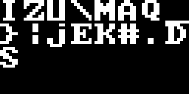

근거: `local_experiment_archive/runs/v6-study-r2/C/runs/P-G-CGGE/Main-0/u40000/segments/seg-00040000.npz`

### C · Train · seed 0 · C_Train_s0_01

- 원본 메시지: <code>&quot;M5ppEjMaQ&lt;G2v&quot;</code>
- 원본 메시지 해시: <code>8f59a03fd47dcf566e151b3ac985256a</code>
- 모델 추론 원본 이미지: <code>미저장</code>
- 디코딩 메시지: <code>미저장</code>
- 디코딩 메시지 해시: <code>계산할 출력 메시지 없음</code>
- 조건 / 메시지의 window 값: <code>W3: 목표 6E1 / 메시지 6E1</code>
- 바이트 길이 / hex: <code>13 / 4d357070456a4d61513c473276</code>
- 입력 위치: <code>update 40,000, 배치 2번째</code>
- 재구성 확인: <code>배치 SHA-256 일치</code>

원본 메시지의 CGGE 인코딩 — 입력 재구성

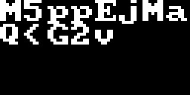

근거: `local_experiment_archive/runs/v6-study-r2/C/runs/P-G-CGGE/Main-0/u40000/segments/seg-00040000.npz`

### C · Train · seed 0 · C_Train_s0_02

- 원본 메시지: <code>&quot;@]M&amp;S3l~[{StZ8KSwY[,vzZvnj&lt;&quot;</code>
- 원본 메시지 해시: <code>c37aecaaa59b01d08e368766acc8524e</code>
- 모델 추론 원본 이미지: <code>미저장</code>
- 디코딩 메시지: <code>미저장</code>
- 디코딩 메시지 해시: <code>계산할 출력 메시지 없음</code>
- 조건 / 메시지의 window 값: <code>W3: 목표 8E3 / 메시지 8E3</code>
- 바이트 길이 / hex: <code>27 / 405d4d2653336c7e5b7b53745a384b5377595b2c767a5a766e6a3c</code>
- 입력 위치: <code>update 40,000, 배치 3번째</code>
- 재구성 확인: <code>배치 SHA-256 일치</code>

원본 메시지의 CGGE 인코딩 — 입력 재구성

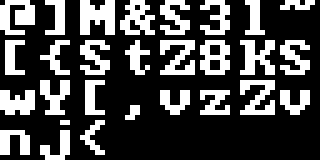

근거: `local_experiment_archive/runs/v6-study-r2/C/runs/P-G-CGGE/Main-0/u40000/segments/seg-00040000.npz`

### C · Train · seed 1 · C_Train_s1_08

- 원본 메시지: <code>&quot;a{%`4Aul&quot;</code>
- 원본 메시지 해시: <code>4037255dac82e7820c7c27d9e458c89a</code>
- 모델 추론 원본 이미지: <code>미저장</code>
- 디코딩 메시지: <code>미저장</code>
- 디코딩 메시지 해시: <code>계산할 출력 메시지 없음</code>
- 조건 / 메시지의 window 값: <code>W3: 목표 0C7 / 메시지 0C7</code>
- 바이트 길이 / hex: <code>8 / 617b25603441756c</code>
- 입력 위치: <code>update 40,000, 배치 1번째</code>
- 재구성 확인: <code>배치 SHA-256 일치</code>

원본 메시지의 CGGE 인코딩 — 입력 재구성

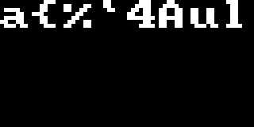

근거: `local_experiment_archive/runs/v6-study-r2/C/runs/P-G-CGGE/Main-1/u40000/segments/seg-00040000.npz`

### C · Train · seed 1 · C_Train_s1_09

- 원본 메시지: <code>&quot;t_\&quot;o6X{Alwc]=1O%jh5mT1tR&quot;</code>
- 원본 메시지 해시: <code>c6c4376afda35ac6175d5d78402af5c1</code>
- 모델 추론 원본 이미지: <code>미저장</code>
- 디코딩 메시지: <code>미저장</code>
- 디코딩 메시지 해시: <code>계산할 출력 메시지 없음</code>
- 조건 / 메시지의 window 값: <code>W3: 목표 175 / 메시지 175</code>
- 바이트 길이 / hex: <code>24 / 745f226f36587b416c77635d3d314f256a68356d54317452</code>
- 입력 위치: <code>update 40,000, 배치 2번째</code>
- 재구성 확인: <code>배치 SHA-256 일치</code>

원본 메시지의 CGGE 인코딩 — 입력 재구성

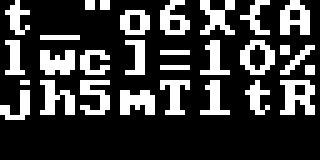

근거: `local_experiment_archive/runs/v6-study-r2/C/runs/P-G-CGGE/Main-1/u40000/segments/seg-00040000.npz`

### C · Train · seed 1 · C_Train_s1_10

- 원본 메시지: <code>&quot;6z(:5ktK.kghY&quot;</code>
- 원본 메시지 해시: <code>4c05a86a0c71c07d2d106edf9f53466d</code>
- 모델 추론 원본 이미지: <code>미저장</code>
- 디코딩 메시지: <code>미저장</code>
- 디코딩 메시지 해시: <code>계산할 출력 메시지 없음</code>
- 조건 / 메시지의 window 값: <code>W3: 목표 2D1 / 메시지 2D1</code>
- 바이트 길이 / hex: <code>13 / 367a283a356b744b2e6b676859</code>
- 입력 위치: <code>update 40,000, 배치 3번째</code>
- 재구성 확인: <code>배치 SHA-256 일치</code>

원본 메시지의 CGGE 인코딩 — 입력 재구성

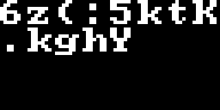

근거: `local_experiment_archive/runs/v6-study-r2/C/runs/P-G-CGGE/Main-1/u40000/segments/seg-00040000.npz`

### C · Train · seed 2 · C_Train_s2_16

- 원본 메시지: <code>&quot;QG&#x27;PrC&quot;</code>
- 원본 메시지 해시: <code>58e2ea4a5b8cd9d8eaf6206ef89223cf</code>
- 모델 추론 원본 이미지: <code>미저장</code>
- 디코딩 메시지: <code>미저장</code>
- 디코딩 메시지 해시: <code>계산할 출력 메시지 없음</code>
- 조건 / 메시지의 window 값: <code>W3: 목표 EAF / 메시지 EAF</code>
- 바이트 길이 / hex: <code>6 / 514727507243</code>
- 입력 위치: <code>update 40,000, 배치 1번째</code>
- 재구성 확인: <code>배치 SHA-256 일치</code>

원본 메시지의 CGGE 인코딩 — 입력 재구성

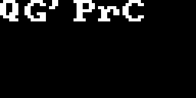

근거: `local_experiment_archive/runs/v6-study-r2/C/runs/P-G-CGGE/Main-2/u40000/segments/seg-00040000.npz`

### C · Train · seed 2 · C_Train_s2_17

- 원본 메시지: <code>&quot;[ZUR:&lt;TvAS,F[&lt;s\&quot;gXn#_Ybp9NrczSJ&quot;</code>
- 원본 메시지 해시: <code>477a24ced3680055450538bf3ddb23f3</code>
- 모델 추론 원본 이미지: <code>미저장</code>
- 디코딩 메시지: <code>미저장</code>
- 디코딩 메시지 해시: <code>계산할 출력 메시지 없음</code>
- 조건 / 메시지의 window 값: <code>W3: 목표 450 / 메시지 450</code>
- 바이트 길이 / hex: <code>31 / 5b5a55523a3c547641532c465b3c732267586e235f596270394e72637a534a</code>
- 입력 위치: <code>update 40,000, 배치 2번째</code>
- 재구성 확인: <code>배치 SHA-256 일치</code>

원본 메시지의 CGGE 인코딩 — 입력 재구성

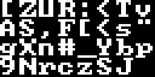

근거: `local_experiment_archive/runs/v6-study-r2/C/runs/P-G-CGGE/Main-2/u40000/segments/seg-00040000.npz`

### C · Train · seed 2 · C_Train_s2_18

- 원본 메시지: <code>&quot;)J&lt;/CwgAu`F(_9Y3&lt;-U*.zxX23z%e!]&quot;</code>
- 원본 메시지 해시: <code>e34e01e999f6bb8cd5e1b0ea9b4e9a88</code>
- 모델 추론 원본 이미지: <code>미저장</code>
- 디코딩 메시지: <code>미저장</code>
- 디코딩 메시지 해시: <code>계산할 출력 메시지 없음</code>
- 조건 / 메시지의 window 값: <code>W3: 목표 D5E / 메시지 D5E</code>
- 바이트 길이 / hex: <code>31 / 294a3c2f43776741756046285f3959333c2d552a2e7a785832337a2565215d</code>
- 입력 위치: <code>update 40,000, 배치 3번째</code>
- 재구성 확인: <code>배치 SHA-256 일치</code>

원본 메시지의 CGGE 인코딩 — 입력 재구성

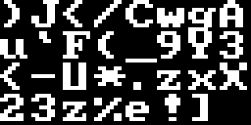

근거: `local_experiment_archive/runs/v6-study-r2/C/runs/P-G-CGGE/Main-2/u40000/segments/seg-00040000.npz`

### C · Valid · seed 0 · C_Valid_s0_03

- 원본 메시지: <code>&quot;&#x27;Q!J{AM6&quot;</code>
- 원본 메시지 해시: <code>23c2de9874aff5560763500fff2e30a5</code>
- 모델 추론 원본 이미지: <code>미저장</code>
- 디코딩 메시지: <code>미저장</code>
- 디코딩 메시지 해시: <code>계산할 출력 메시지 없음</code>
- 조건 / 메시지의 window 값: <code>W3: 목표 076 / 메시지 076</code>
- 바이트 길이 / hex: <code>8 / 2751214a7b414d36</code>
- 입력 위치: <code>update 40,000, 배치 1번째</code>
- 재구성 확인: <code>동결 코드·난수 namespace 일치; 원 입력 체크섬 미저장</code>

원본 메시지의 CGGE 인코딩 — 입력 재구성

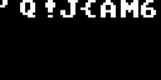

근거: `local_experiment_archive/runs/v6-study-r2/C/runs/P-G-CGGE/Main-0/u40000/diagnostics/diag-00040000.json`

### C · Valid · seed 0 · C_Valid_s0_04

- 원본 메시지: <code>&quot;-0V(2!C&quot;</code>
- 원본 메시지 해시: <code>3ada357334e4338fad7aa0b3352be29d</code>
- 모델 추론 원본 이미지: <code>미저장</code>
- 디코딩 메시지: <code>미저장</code>
- 디코딩 메시지 해시: <code>계산할 출력 메시지 없음</code>
- 조건 / 메시지의 window 값: <code>W3: 목표 AD7 / 메시지 AD7</code>
- 바이트 길이 / hex: <code>7 / 2d305628322143</code>
- 입력 위치: <code>update 40,000, 배치 2번째</code>
- 재구성 확인: <code>동결 코드·난수 namespace 일치; 원 입력 체크섬 미저장</code>

원본 메시지의 CGGE 인코딩 — 입력 재구성

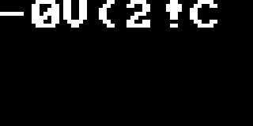

근거: `local_experiment_archive/runs/v6-study-r2/C/runs/P-G-CGGE/Main-0/u40000/diagnostics/diag-00040000.json`

### C · Valid · seed 0 · C_Valid_s0_05

- 원본 메시지: <code>&quot;s@6g*9klA&#x27;fTJ&quot;</code>
- 원본 메시지 해시: <code>2c9142c4f8de9359961eb1c45a0f5fb6</code>
- 모델 추론 원본 이미지: <code>미저장</code>
- 디코딩 메시지: <code>미저장</code>
- 디코딩 메시지 해시: <code>계산할 출력 메시지 없음</code>
- 조건 / 메시지의 window 값: <code>W3: 목표 961 / 메시지 961</code>
- 바이트 길이 / hex: <code>13 / 734036672a396b6c412766544a</code>
- 입력 위치: <code>update 40,000, 배치 3번째</code>
- 재구성 확인: <code>동결 코드·난수 namespace 일치; 원 입력 체크섬 미저장</code>

원본 메시지의 CGGE 인코딩 — 입력 재구성

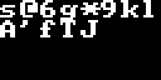

근거: `local_experiment_archive/runs/v6-study-r2/C/runs/P-G-CGGE/Main-0/u40000/diagnostics/diag-00040000.json`

### C · Valid · seed 1 · C_Valid_s1_11

- 원본 메시지: <code>&quot;2awD&gt;{j&quot;</code>
- 원본 메시지 해시: <code>434acc0f6afa445986cb520b12d08d7f</code>
- 모델 추론 원본 이미지: <code>미저장</code>
- 디코딩 메시지: <code>미저장</code>
- 디코딩 메시지 해시: <code>계산할 출력 메시지 없음</code>
- 조건 / 메시지의 window 값: <code>W3: 목표 86C / 메시지 86C</code>
- 바이트 길이 / hex: <code>7 / 326177443e7b6a</code>
- 입력 위치: <code>update 40,000, 배치 1번째</code>
- 재구성 확인: <code>동결 코드·난수 namespace 일치; 원 입력 체크섬 미저장</code>

원본 메시지의 CGGE 인코딩 — 입력 재구성

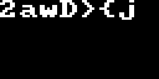

근거: `local_experiment_archive/runs/v6-study-r2/C/runs/P-G-CGGE/Main-1/u40000/diagnostics/diag-00040000.json`

### C · Valid · seed 1 · C_Valid_s1_12

- 원본 메시지: <code>&quot;}l&gt;n$Gtdi&quot;</code>
- 원본 메시지 해시: <code>8097bf3fa95c7587e30b3681df5b4fdf</code>
- 모델 추론 원본 이미지: <code>미저장</code>
- 디코딩 메시지: <code>미저장</code>
- 디코딩 메시지 해시: <code>계산할 출력 메시지 없음</code>
- 조건 / 메시지의 window 값: <code>W3: 목표 E30 / 메시지 E30</code>
- 바이트 길이 / hex: <code>9 / 7d6c3e6e2447746469</code>
- 입력 위치: <code>update 40,000, 배치 2번째</code>
- 재구성 확인: <code>동결 코드·난수 namespace 일치; 원 입력 체크섬 미저장</code>

원본 메시지의 CGGE 인코딩 — 입력 재구성

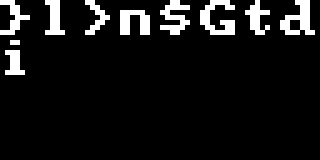

근거: `local_experiment_archive/runs/v6-study-r2/C/runs/P-G-CGGE/Main-1/u40000/diagnostics/diag-00040000.json`

### C · Valid · seed 1 · C_Valid_s1_13

- 원본 메시지: <code>&quot;]{#C|-H)H*&#x27;)z@S&quot;</code>
- 원본 메시지 해시: <code>eb3e6640cce9c6260c0125f749c8c094</code>
- 모델 추론 원본 이미지: <code>미저장</code>
- 디코딩 메시지: <code>미저장</code>
- 디코딩 메시지 해시: <code>계산할 출력 메시지 없음</code>
- 조건 / 메시지의 window 값: <code>W3: 목표 0C0 / 메시지 0C0</code>
- 바이트 길이 / hex: <code>15 / 5d7b23437c2d4829482a27297a4053</code>
- 입력 위치: <code>update 40,000, 배치 3번째</code>
- 재구성 확인: <code>동결 코드·난수 namespace 일치; 원 입력 체크섬 미저장</code>

원본 메시지의 CGGE 인코딩 — 입력 재구성

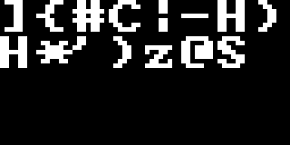

근거: `local_experiment_archive/runs/v6-study-r2/C/runs/P-G-CGGE/Main-1/u40000/diagnostics/diag-00040000.json`

### C · Valid · seed 2 · C_Valid_s2_19

- 원본 메시지: <code>&quot;Yn87:iPj&quot;</code>
- 원본 메시지 해시: <code>923e91bde929635d019245e477f067f5</code>
- 모델 추론 원본 이미지: <code>미저장</code>
- 디코딩 메시지: <code>미저장</code>
- 디코딩 메시지 해시: <code>계산할 출력 메시지 없음</code>
- 조건 / 메시지의 window 값: <code>W3: 목표 019 / 메시지 019</code>
- 바이트 길이 / hex: <code>8 / 596e38373a69506a</code>
- 입력 위치: <code>update 40,000, 배치 1번째</code>
- 재구성 확인: <code>동결 코드·난수 namespace 일치; 원 입력 체크섬 미저장</code>

원본 메시지의 CGGE 인코딩 — 입력 재구성

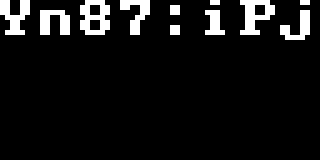

근거: `local_experiment_archive/runs/v6-study-r2/C/runs/P-G-CGGE/Main-2/u40000/diagnostics/diag-00040000.json`

### C · Valid · seed 2 · C_Valid_s2_20

- 원본 메시지: <code>&quot;/@T8\\mRx=Y&quot;</code>
- 원본 메시지 해시: <code>cf72c426bfd13f6cca59a3e8f1ad393b</code>
- 모델 추론 원본 이미지: <code>미저장</code>
- 디코딩 메시지: <code>미저장</code>
- 디코딩 메시지 해시: <code>계산할 출력 메시지 없음</code>
- 조건 / 메시지의 window 값: <code>W3: 목표 CA5 / 메시지 CA5</code>
- 바이트 길이 / hex: <code>10 / 2f4054385c6d52783d59</code>
- 입력 위치: <code>update 40,000, 배치 2번째</code>
- 재구성 확인: <code>동결 코드·난수 namespace 일치; 원 입력 체크섬 미저장</code>

원본 메시지의 CGGE 인코딩 — 입력 재구성

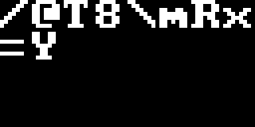

근거: `local_experiment_archive/runs/v6-study-r2/C/runs/P-G-CGGE/Main-2/u40000/diagnostics/diag-00040000.json`

### C · Valid · seed 2 · C_Valid_s2_21

- 원본 메시지: <code>&quot;jBOZ*hT0Q=kv2Ajg{A[&#x27;W*|AH|JItj&quot;</code>
- 원본 메시지 해시: <code>00baae035b9214fbed6d31df678db5cb</code>
- 모델 추론 원본 이미지: <code>미저장</code>
- 디코딩 메시지: <code>미저장</code>
- 디코딩 메시지 해시: <code>계산할 출력 메시지 없음</code>
- 조건 / 메시지의 window 값: <code>W3: 목표 ED6 / 메시지 ED6</code>
- 바이트 길이 / hex: <code>30 / 6a424f5a2a685430513d6b7632416a677b415b27572a7c41487c4a49746a</code>
- 입력 위치: <code>update 40,000, 배치 3번째</code>
- 재구성 확인: <code>동결 코드·난수 namespace 일치; 원 입력 체크섬 미저장</code>

원본 메시지의 CGGE 인코딩 — 입력 재구성

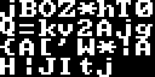

근거: `local_experiment_archive/runs/v6-study-r2/C/runs/P-G-CGGE/Main-2/u40000/diagnostics/diag-00040000.json`

### C · Test · seed 0 · C_Test_s0_06

- 원본 메시지: <code>해당 없음: 목표 해시를 직접 추출한 시행</code>
- 원본 메시지 해시: <code>해당 없음</code>
- 모델 추론 원본 이미지: <code>미저장</code>
- 디코딩 메시지: <code>&quot;u.l.r9vi(.oRR^9i0!7&quot;</code>
- 디코딩 메시지 해시: <code>4625b1811d84bc97ca87486b6b975c5e</code>
- 조건 / 메시지의 window 값: <code>W3: 목표 E3D / 메시지 CA8</code>
- 바이트 길이 / hex: <code>19 / 752e6c2e72397669282e6f52525e3969302137</code>
- 원장 기록: <code>시행 5, 후보 1; 실패; strict=True</code>

디코딩 메시지의 재인코딩 — 추론 원본 아님

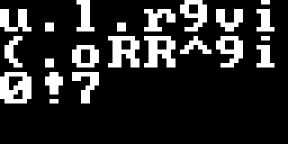

근거: `local_experiment_archive/runs/v6-study-r2/C/eval/P-G-CGGE/Main-0/block-1.bin`

### C · Test · seed 0 · C_Test_s0_07

- 원본 메시지: <code>해당 없음: 목표 해시를 직접 추출한 시행</code>
- 원본 메시지 해시: <code>해당 없음</code>
- 모델 추론 원본 이미지: <code>미저장</code>
- 디코딩 메시지: <code>&quot;uokTwva[+VgQ0S`i[mrr&quot;</code>
- 디코딩 메시지 해시: <code>fcefd5bd8c1a6a19e3da34bf9835314d</code>
- 조건 / 메시지의 window 값: <code>W3: 목표 E3D / 메시지 E3D</code>
- 바이트 길이 / hex: <code>20 / 756f6b547776615b2b566751305360695b6d7272</code>
- 원장 기록: <code>시행 5, 후보 46; 성공; strict=False</code>

디코딩 메시지의 재인코딩 — 추론 원본 아님

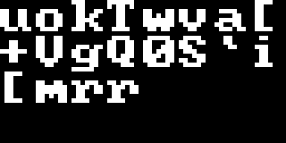

근거: `local_experiment_archive/runs/v6-study-r2/C/eval/P-G-CGGE/Main-0/block-1.bin`

### C · Test · seed 1 · C_Test_s1_14

- 원본 메시지: <code>해당 없음: 목표 해시를 직접 추출한 시행</code>
- 원본 메시지 해시: <code>해당 없음</code>
- 모델 추론 원본 이미지: <code>미저장</code>
- 디코딩 메시지: <code>&quot;&lt;k.9&#x27;=cD}t.l9x1T}vzo&#x27;7:&gt;RC&quot;</code>
- 디코딩 메시지 해시: <code>0f24a4bdebf381073a8761a94fbbcd6a</code>
- 조건 / 메시지의 window 값: <code>W3: 목표 0A8 / 메시지 3A8</code>
- 바이트 길이 / hex: <code>26 / 3c6b2e39273d63447d742e6c397831547d767a6f27373a3e5243</code>
- 원장 기록: <code>시행 65, 후보 1; 실패; strict=False</code>

디코딩 메시지의 재인코딩 — 추론 원본 아님

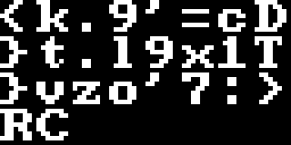

근거: `local_experiment_archive/runs/v6-study-r2/C/eval/P-G-CGGE/Main-1/block-1.bin`

### C · Test · seed 1 · C_Test_s1_15

- 원본 메시지: <code>해당 없음: 목표 해시를 직접 추출한 시행</code>
- 원본 메시지 해시: <code>해당 없음</code>
- 모델 추론 원본 이미지: <code>미저장</code>
- 디코딩 메시지: <code>&quot;uj&lt;bAX8[@BU-b]/$NJ*yDi{&#x27;?zUrl-&quot;</code>
- 디코딩 메시지 해시: <code>c386e74bc5da5a2c0a843101c3719576</code>
- 조건 / 메시지의 window 값: <code>W3: 목표 0A8 / 메시지 0A8</code>
- 바이트 길이 / hex: <code>30 / 756a3c624158385b4042552d625d2f244e4a2a7944697b273f7a55726c2d</code>
- 원장 기록: <code>시행 65, 후보 68; 성공; strict=False</code>

디코딩 메시지의 재인코딩 — 추론 원본 아님

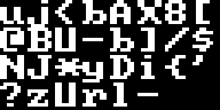

근거: `local_experiment_archive/runs/v6-study-r2/C/eval/P-G-CGGE/Main-1/block-1.bin`

### C · Test · seed 2 · C_Test_s2_22

- 원본 메시지: <code>해당 없음: 목표 해시를 직접 추출한 시행</code>
- 원본 메시지 해시: <code>해당 없음</code>
- 모델 추론 원본 이미지: <code>미저장</code>
- 디코딩 메시지: <code>&quot;:i..&#x27;-[OVhi3`ucnDNK[cvo0&quot;</code>
- 디코딩 메시지 해시: <code>46956fb0a70a5885577176d3150e9807</code>
- 조건 / 메시지의 window 값: <code>W3: 목표 588 / 메시지 577</code>
- 바이트 길이 / hex: <code>24 / 3a692e2e272d5b4f566869336075636e444e4b5b63766f30</code>
- 원장 기록: <code>시행 178, 후보 1; 실패; strict=False</code>

디코딩 메시지의 재인코딩 — 추론 원본 아님

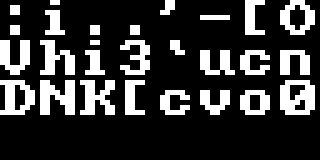

근거: `local_experiment_archive/runs/v6-study-r2/C/eval/P-G-CGGE/Main-2/block-1.bin`

### C · Test · seed 2 · C_Test_s2_23

- 원본 메시지: <code>해당 없음: 목표 해시를 직접 추출한 시행</code>
- 원본 메시지 해시: <code>해당 없음</code>
- 모델 추론 원본 이미지: <code>미저장</code>
- 디코딩 메시지: <code>&quot;Z][1L\\S0p6\\10%nt&quot;</code>
- 디코딩 메시지 해시: <code>d8c8a7be6bfd8a6458811076737329b3</code>
- 조건 / 메시지의 window 값: <code>W3: 목표 588 / 메시지 588</code>
- 바이트 길이 / hex: <code>16 / 5a5d5b314c5c533070365c3130256e74</code>
- 원장 기록: <code>시행 178, 후보 34; 성공; strict=True</code>

디코딩 메시지의 재인코딩 — 추론 원본 아님

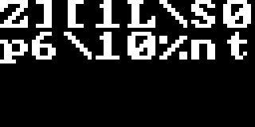

근거: `local_experiment_archive/runs/v6-study-r2/C/eval/P-G-CGGE/Main-2/block-1.bin`

## 4. 보조 실험 — P 및 A-Q

아래 결과도 P-G-CGGE만 발췌했다. P는 4단계로 약화한 MD5(W1)이고, A-Q는 메시지 첫 3개의 대문자 16진수 문자를 조건으로 삼는 synthetic 과제다. 세 과제는 서로 다른 모델을 학습했으며 C의 정규 MD5 결과와 합산하지 않는다. P 사례의 32자리 해시는 4단계 함수의 출력으로 표준 MD5와 다르다.

| 과제 / seed | Train 마지막 4,000 평균 | Valid @40,000 | Valid CLP 평균 @40,000 |
|---|---|---|---|
| A-Q / 0 | 3.644250 | 3.646744 | +0.537205 |
| A-Q / 1 | 3.647094 | 3.648384 | +0.530846 |
| A-Q / 2 | 3.646185 | 3.649898 | +0.537765 |
| P / 0 | 3.726253 | 3.734458 | +0.061973 |

| 과제 | 평가 결과 |
|---|---|
| P / W1 / r=4 | Success@100: 620 / 4,096 = 15.1367%; 후보 409,600개 |
| P 조건 신호 | CLP z=114.307247; GEN_4=true; INFO_4=true |
| A-Q synthetic / 각 seed | 정상 조건 512/512, 반전 조건 512/512; 기존 조건으로의 오성공 0 |
| A-Q CLP z / seed 0, 1, 2 | 115.906184, 114.826750, 116.875125 |

### P · Train · seed 0 · P_Train_s0_24

- 원본 메시지: <code>&quot;EO(#)@(I.dIz%,AD&quot;</code>
- 원본 메시지 해시: <code>07ad8ca035c260eeaeaec14e3ebd284c</code>
- 모델 추론 원본 이미지: <code>미저장</code>
- 디코딩 메시지: <code>미저장</code>
- 디코딩 메시지 해시: <code>계산할 출력 메시지 없음</code>
- 조건 / 메시지의 window 값: <code>W1: 목표 07A / 메시지 07A</code>
- 바이트 길이 / hex: <code>16 / 454f2823294028492e64497a252c4144</code>
- 입력 위치: <code>update 40,000, 배치 1번째</code>
- 재구성 확인: <code>배치 SHA-256 일치</code>

원본 메시지의 CGGE 인코딩 — 입력 재구성

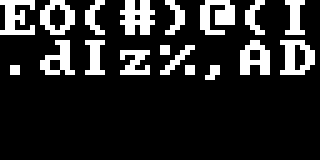

근거: `local_experiment_archive/runs/v6-study-r2/P/runs/P-G-CGGE/Main-0/u40000/segments/seg-00040000.npz`

### P · Train · seed 0 · P_Train_s0_25

- 원본 메시지: <code>&quot;&gt;6?C=)M6h?i|6r.&amp;xBT\&quot;OVKf^Bv&quot;</code>
- 원본 메시지 해시: <code>172900ac2030457f59442b67496bec65</code>
- 모델 추론 원본 이미지: <code>미저장</code>
- 디코딩 메시지: <code>미저장</code>
- 디코딩 메시지 해시: <code>계산할 출력 메시지 없음</code>
- 조건 / 메시지의 window 값: <code>W1: 목표 172 / 메시지 172</code>
- 바이트 길이 / hex: <code>27 / 3e363f433d294d36683f697c36722e26784254224f564b665e4276</code>
- 입력 위치: <code>update 40,000, 배치 2번째</code>
- 재구성 확인: <code>배치 SHA-256 일치</code>

원본 메시지의 CGGE 인코딩 — 입력 재구성

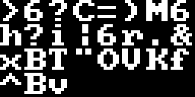

근거: `local_experiment_archive/runs/v6-study-r2/P/runs/P-G-CGGE/Main-0/u40000/segments/seg-00040000.npz`

### P · Train · seed 0 · P_Train_s0_26

- 원본 메시지: <code>&quot;gA7X!T*G^U&amp;__?&quot;</code>
- 원본 메시지 해시: <code>a1bd052890b70b43b3fa27eaa7a0dfc3</code>
- 모델 추론 원본 이미지: <code>미저장</code>
- 디코딩 메시지: <code>미저장</code>
- 디코딩 메시지 해시: <code>계산할 출력 메시지 없음</code>
- 조건 / 메시지의 window 값: <code>W1: 목표 A1B / 메시지 A1B</code>
- 바이트 길이 / hex: <code>14 / 6741375821542a475e55265f5f3f</code>
- 입력 위치: <code>update 40,000, 배치 3번째</code>
- 재구성 확인: <code>배치 SHA-256 일치</code>

원본 메시지의 CGGE 인코딩 — 입력 재구성

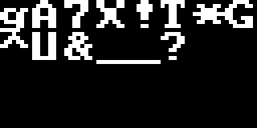

근거: `local_experiment_archive/runs/v6-study-r2/P/runs/P-G-CGGE/Main-0/u40000/segments/seg-00040000.npz`

### P · Valid · seed 0 · P_Valid_s0_27

- 원본 메시지: <code>&quot;A+I~h@j4.k+TS&quot;</code>
- 원본 메시지 해시: <code>b4aafa3017aed8d4286f565e98ec671c</code>
- 모델 추론 원본 이미지: <code>미저장</code>
- 디코딩 메시지: <code>미저장</code>
- 디코딩 메시지 해시: <code>계산할 출력 메시지 없음</code>
- 조건 / 메시지의 window 값: <code>W1: 목표 B4A / 메시지 B4A</code>
- 바이트 길이 / hex: <code>13 / 412b497e68406a342e6b2b5453</code>
- 입력 위치: <code>update 40,000, 배치 1번째</code>
- 재구성 확인: <code>동결 코드·난수 namespace 일치; 원 입력 체크섬 미저장</code>

원본 메시지의 CGGE 인코딩 — 입력 재구성

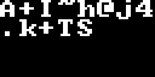

근거: `local_experiment_archive/runs/v6-study-r2/P/runs/P-G-CGGE/Main-0/u40000/diagnostics/diag-00040000.json`

### P · Valid · seed 0 · P_Valid_s0_28

- 원본 메시지: <code>&quot;#:j9&amp;!&amp;~R^r-\\r&amp;6J&lt;n^%p&#x27;6%[|Z&quot;</code>
- 원본 메시지 해시: <code>921b82c1961390467d92ef8f21610d58</code>
- 모델 추론 원본 이미지: <code>미저장</code>
- 디코딩 메시지: <code>미저장</code>
- 디코딩 메시지 해시: <code>계산할 출력 메시지 없음</code>
- 조건 / 메시지의 window 값: <code>W1: 목표 921 / 메시지 921</code>
- 바이트 길이 / hex: <code>28 / 233a6a392621267e525e722d5c7226364a3c6e5e25702736255b7c5a</code>
- 입력 위치: <code>update 40,000, 배치 2번째</code>
- 재구성 확인: <code>동결 코드·난수 namespace 일치; 원 입력 체크섬 미저장</code>

원본 메시지의 CGGE 인코딩 — 입력 재구성

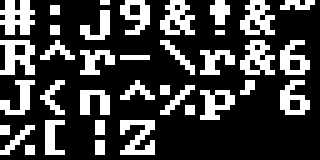

근거: `local_experiment_archive/runs/v6-study-r2/P/runs/P-G-CGGE/Main-0/u40000/diagnostics/diag-00040000.json`

### P · Valid · seed 0 · P_Valid_s0_29

- 원본 메시지: <code>&quot;B9%a}a.XSpJC}PVp]xO!qL`1]&quot;</code>
- 원본 메시지 해시: <code>26ab019fd3aa4d39b474c418a61c91bc</code>
- 모델 추론 원본 이미지: <code>미저장</code>
- 디코딩 메시지: <code>미저장</code>
- 디코딩 메시지 해시: <code>계산할 출력 메시지 없음</code>
- 조건 / 메시지의 window 값: <code>W1: 목표 26A / 메시지 26A</code>
- 바이트 길이 / hex: <code>25 / 423925617d612e5853704a437d5056705d784f21714c60315d</code>
- 입력 위치: <code>update 40,000, 배치 3번째</code>
- 재구성 확인: <code>동결 코드·난수 namespace 일치; 원 입력 체크섬 미저장</code>

원본 메시지의 CGGE 인코딩 — 입력 재구성

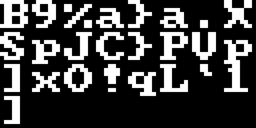

근거: `local_experiment_archive/runs/v6-study-r2/P/runs/P-G-CGGE/Main-0/u40000/diagnostics/diag-00040000.json`

### P · Test · seed 0 · P_Test_s0_30

- 원본 메시지: <code>해당 없음: 목표 해시를 직접 추출한 시행</code>
- 원본 메시지 해시: <code>해당 없음</code>
- 모델 추론 원본 이미지: <code>미저장</code>
- 디코딩 메시지: <code>&quot;l[8:.?-qQo88j&quot;</code>
- 디코딩 메시지 해시: <code>12c09228aa17a6d01393de7cc985ce42</code>
- 조건 / 메시지의 window 값: <code>W1: 목표 93A / 메시지 12C</code>
- 바이트 길이 / hex: <code>13 / 6c5b383a2e3f2d71516f38386a</code>
- 원장 기록: <code>시행 6, 후보 1; 실패; strict=False</code>

디코딩 메시지의 재인코딩 — 추론 원본 아님

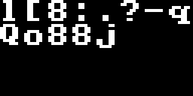

근거: `local_experiment_archive/runs/v6-study-r2/P/eval/P-G-CGGE/Main-0/block-1.bin`

### P · Test · seed 0 · P_Test_s0_31

- 원본 메시지: <code>해당 없음: 목표 해시를 직접 추출한 시행</code>
- 원본 메시지 해시: <code>해당 없음</code>
- 모델 추론 원본 이미지: <code>미저장</code>
- 디코딩 메시지: <code>&quot;A39;x1R-&quot;</code>
- 디코딩 메시지 해시: <code>93aafea821e92d2f56c9bd5705ec7ed3</code>
- 조건 / 메시지의 window 값: <code>W1: 목표 93A / 메시지 93A</code>
- 바이트 길이 / hex: <code>8 / 4133393b7831522d</code>
- 원장 기록: <code>시행 6, 후보 80; 성공; strict=True</code>

디코딩 메시지의 재인코딩 — 추론 원본 아님

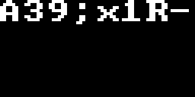

근거: `local_experiment_archive/runs/v6-study-r2/P/eval/P-G-CGGE/Main-0/block-1.bin`

## 5. 검증 · 해석 범위

본문 수치는 저장된 집계를 사용했다. 예시 해시는 표시된 메시지에서 직접 계산했다. 추론 이미지 미저장은 명세 §5.5와 runtime의 저장 형식에서 확인했다. 특히 Test의 원문은 원래 실험 설계에 없으므로 원문/추론 이미지의 쌍별 비교를 만들 수 없다. Valid 입력은 재구성했으나 메시지 자체의 저장 체크섬이 없어 Train과 같은 수준의 대조 검증을 주장하지 않는다.

- 입력 재구성에 사용한 소스 5개와 NumPy 버전이 동결 기록과 일치
- C seed 0: 마지막 Train 배치 256건의 data_sha256 일치
- C seed 1: 마지막 Train 배치 256건의 data_sha256 일치
- C seed 2: 마지막 Train 배치 256건의 data_sha256 일치
- P seed 0: 마지막 Train 배치 256건의 data_sha256 일치
- 읽은 segment·진단 JSON·원장·trial 요약의 기록된 파일 체크섬 일치
- 저장된 trial 요약의 합계와 block JSON 및 C 최종 집계 일치
- 표본 32건의 CGGE 인코딩/디코딩 round-trip 일치; 원문 또는 후보 해시 직접 계산
- Test 후보 재생성·모델 추론·전체 원장 재평가 없이 기존 기록만 추출

데이터: `records.json` (표본 32건, checkpoint별 Train/Valid 진단 70행, 출처 파일 SHA-256 포함).

원본 archive·실험 코드·기존 자료는 수정하지 않았다. 모델 추론, 재학습, Metal 테스트, 금지된 Test 재평가는 실행하지 않았다.
